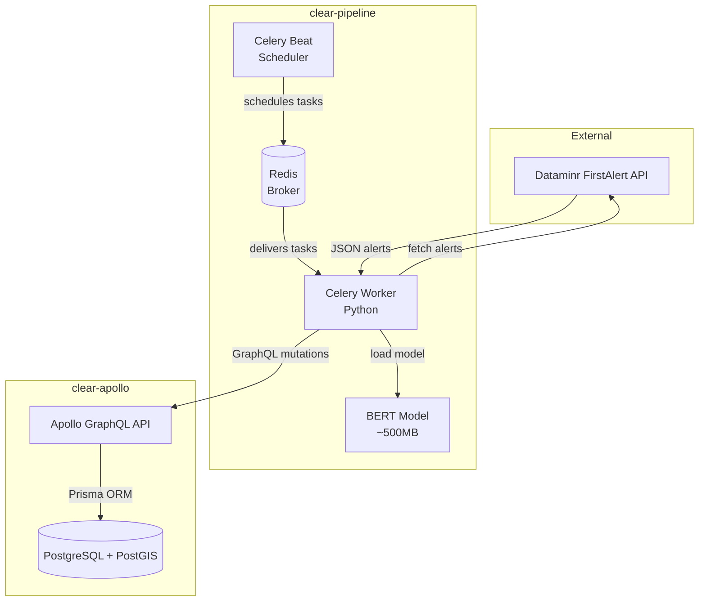
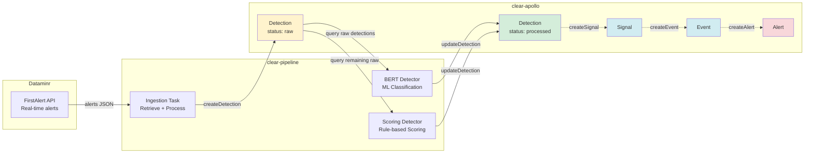
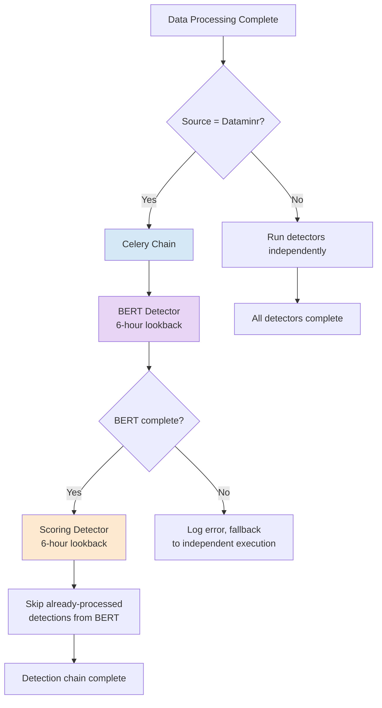

# CLEAR Pipeline — Architecture Diagram

## System Context

```mermaid
graph TB
    subgraph External
        DM[Dataminr FirstAlert API]
    end

    subgraph clear-pipeline
        Beat[Celery Beat<br/>Scheduler]
        Worker[Celery Worker<br/>Python]
        Redis[(Redis<br/>Broker)]
        BERT[BERT Model<br/>~500MB]
    end

    subgraph clear-apollo
        GQL[Apollo GraphQL API]
        DB[(PostgreSQL + PostGIS)]
    end

    Beat -->|schedules tasks| Redis
    Redis -->|delivers tasks| Worker
    Worker -->|fetch alerts| DM
    DM -->|JSON alerts| Worker
    Worker -->|load model| BERT
    Worker -->|GraphQL mutations| GQL
    GQL -->|Prisma ORM| DB
```

---

## Full Pipeline Sequence Diagram

```mermaid
sequenceDiagram
    participant Beat as Celery Beat
    participant Redis as Redis Broker
    participant Worker as Celery Worker
    participant DM_Auth as Dataminr Auth API
    participant DM_Alerts as Dataminr Alerts API
    participant Apollo as Apollo GraphQL API
    participant BERT as BERT Model
    participant Scoring as Scoring Engine

    Note over Beat,Scoring: Phase 1 — Ingestion Pipeline (every 10 min)

    Beat->>Redis: Schedule full_pipeline task
    Redis->>Worker: Deliver task

    rect rgb(240, 248, 255)
        Note over Worker,DM_Auth: 1a. Authentication
        Worker->>Worker: Check cached DmAuth token
        alt Token expired or missing
            Worker->>DM_Auth: POST /auth/1/userAuthorization<br/>{api_user_id, api_password}
            DM_Auth-->>Worker: {authorizationToken, expirationTime}
            Worker->>Worker: Cache token with TTL
        end
    end

    rect rgb(240, 255, 240)
        Note over Worker,DM_Alerts: 1b. Alert Retrieval
        loop Cursor-based pagination (max 5 requests)
            Worker->>DM_Alerts: GET /alerts/1/alerts<br/>?alertversion=19&from={cursor}<br/>Authorization: DmAuth {token}
            DM_Alerts-->>Worker: {alerts: [...], to: next_cursor}
            Worker->>Worker: Accumulate alerts
            alt No more alerts or max requests reached
                Note over Worker: Break pagination loop
            end
        end
        Worker->>Worker: Save raw JSON to disk (backup)
    end

    rect rgb(255, 248, 240)
        Note over Worker,Apollo: 1c. Processing & Ingestion
        Worker->>Apollo: query { dataSources { id name } }
        Apollo-->>Worker: Dataminr source ID (or create if missing)

        Worker->>Apollo: query { locations(level: 0) { id geoId name } }
        Apollo-->>Worker: Location cache

        loop For each raw alert
            Worker->>Worker: Extract fields:<br/>alertId, headline, coordinates,<br/>topics, categories, alertType,<br/>publicPost, linkedAlerts
            Worker->>Worker: Compose text:<br/>"Headline: ... | Title: ... | Context: ..."
            Worker->>Worker: Match location from coordinates/name

            alt Location not found in cache
                Worker->>Apollo: mutation createLocation<br/>{geoId, name, level, lat, lng}
                Apollo-->>Worker: New location ID
                Worker->>Worker: Add to local cache
            end

            Worker->>Apollo: mutation createDetection {<br/>  title: "Headline: ..."<br/>  confidence: 1.0<br/>  status: "raw"<br/>  detectedAt: "2026-03-18T..."<br/>  rawData: {alertId, _extracted_fields, ...}<br/>  sourceId: "..."<br/>  locationIds: ["..."]<br/>}
            Apollo-->>Worker: Detection ID
        end
    end

    Note over Beat,Scoring: Phase 2 — Detection Pipeline (chained)

    Worker->>Redis: Schedule detection chain:<br/>BERT → Scoring
    Redis->>Worker: Deliver BERT task

    rect rgb(248, 240, 255)
        Note over Worker,BERT: 2a. BERT Detection
        Worker->>Apollo: query { detections(<br/>  status: "raw"<br/>  source: "dataminr"<br/>  detectedAt > now-6h<br/>) { id title rawData locations { id } } }
        Apollo-->>Worker: Recent raw detections

        loop Process in batches of 8
            Worker->>Worker: Extract headlines from rawData
            Worker->>BERT: Tokenize + classify headlines
            BERT-->>Worker: predictions[], probabilities[]

            loop For each alert prediction (prob >= 0.5)
                Worker->>Worker: Determine shock type:<br/>1. Keyword override check<br/>2. Centroid classification (MiniLM-L6-v2)
                Worker->>Worker: Calculate severity:<br/>Base (Flash=4, Urgent=3, Alert=2)<br/>+ Boost from impact numbers (0-2)<br/>= capped at 5

                Worker->>Apollo: mutation updateDetection {<br/>  id: "..."<br/>  status: "processed"<br/>  confidence: 0.87<br/>  rawData: {..., bert_confidence, shock_type, severity}<br/>}
                Apollo-->>Worker: Updated detection
            end
        end
    end

    rect rgb(255, 245, 245)
        Note over Worker,Scoring: 2b. Scoring Detection (after BERT completes)
        Redis->>Worker: Deliver Scoring task (chained)

        Worker->>Apollo: query { detections(<br/>  status: "raw"<br/>  source: "dataminr"<br/>  detectedAt > now-6h<br/>) { id title rawData locations { id } } }
        Apollo-->>Worker: Remaining raw detections<br/>(BERT-processed ones now have status "processed")

        loop For each remaining raw detection
            Worker->>Scoring: Score alert:<br/>1. Field scoring (exact, contains, regex)<br/>2. Keyword scoring (weighted)<br/>3. Location multipliers
            Scoring-->>Worker: {score, severity_level, shock_type}

            alt Score >= min_detection_score (8)
                Worker->>Worker: Apply temporal clustering<br/>(6-hour window, min 2 alerts)
                Worker->>Apollo: mutation updateDetection {<br/>  id: "..."<br/>  status: "processed"<br/>  confidence: normalized_score<br/>  rawData: {..., scoring_data, shock_type}<br/>}
                Apollo-->>Worker: Updated detection
            end
        end
    end

    Note over Beat,Scoring: Phase 3 — Signal & Alert Promotion (future)

    rect rgb(245, 245, 245)
        Note over Worker,Apollo: 3. Downstream (handled by Apollo/UI)
        Note right of Apollo: Processed detections can be<br/>promoted to Signals → Events → Alerts<br/>via Apollo mutations (manual or automated)
    end
```

---

## Data Flow Summary

```mermaid
flowchart LR
    subgraph Dataminr
        API[FirstAlert API<br/>Real-time alerts]
    end

    subgraph clear-pipeline
        Ingest[Ingestion Task<br/>Retrieve + Process]
        BertDet[BERT Detector<br/>ML Classification]
        ScoreDet[Scoring Detector<br/>Rule-based Scoring]
    end

    subgraph clear-apollo
        DetRaw[Detection<br/>status: raw]
        DetProc[Detection<br/>status: processed]
        Signal[Signal]
        Event[Event]
        Alert[Alert]
    end

    API -->|alerts JSON| Ingest
    Ingest -->|createDetection| DetRaw
    DetRaw -->|query raw detections| BertDet
    BertDet -->|updateDetection| DetProc
    DetRaw -->|query remaining raw| ScoreDet
    ScoreDet -->|updateDetection| DetProc
    DetProc -.->|createSignal| Signal
    Signal -.->|createEvent| Event
    Event -.->|createAlert| Alert

    style DetRaw fill:#fff3cd
    style DetProc fill:#d4edda
    style Signal fill:#d1ecf1
    style Event fill:#d1ecf1
    style Alert fill:#f8d7da
```

---

## Detection Chaining Detail

```mermaid
flowchart TD
    Start[Data Processing Complete] --> Check{Source = Dataminr?}
    Check -->|Yes| Chain[Celery Chain]
    Check -->|No| Independent[Run detectors independently]

    Chain --> BERT[BERT Detector<br/>6-hour lookback]
    BERT --> BertDone{BERT complete?}
    BertDone -->|Yes| Score[Scoring Detector<br/>6-hour lookback]
    BertDone -->|No| Fail[Log error, fallback<br/>to independent execution]

    Score --> ScoreDone[Skip already-processed<br/>detections from BERT]
    ScoreDone --> Done[Detection chain complete]

    Independent --> IndDone[All detectors complete]

    style BERT fill:#e8d5f5
    style Score fill:#fde8d0
    style Chain fill:#d5e8f5
```
