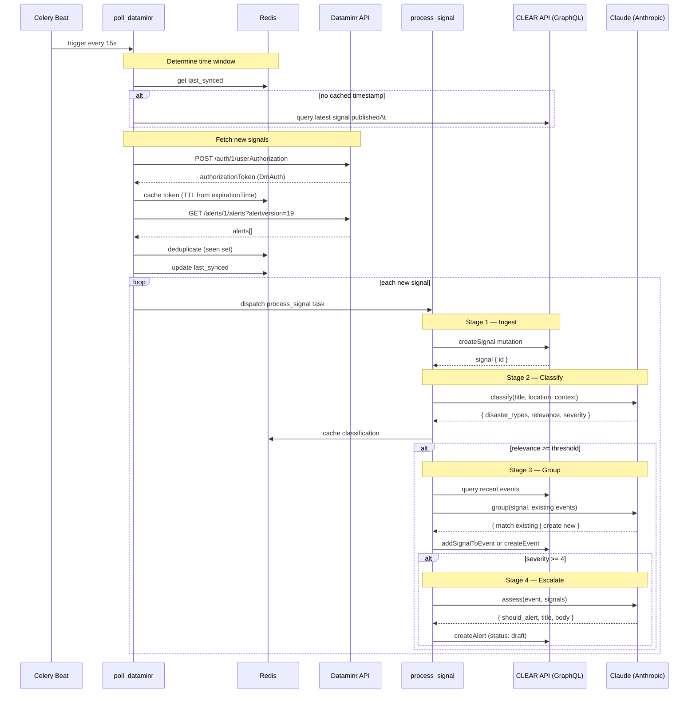

# CLEAR Pipeline

> **Status: In Development** — This project is under active development and not yet production-ready.

Data ingestion pipeline that retrieves signals from the Dataminr First Alert API, runs ML-based classification and clustering, and writes structured results (signals → events → alerts) into the CLEAR system via GraphQL.

## Architecture

```
Dataminr API → [poll_dataminr] → [process_signal] → CLEAR API (GraphQL)
                                      │
                              ┌───────┴───────┐
                              │  ML Pipeline   │
                              │  classify →    │
                              │  group →       │
                              │  assess        │
                              └────────────────┘
```

## Setup

```bash
# Install dependencies
pip install uv
uv pip install --system .

# Copy env and fill in values
cp .env.example .env

# Run with Docker
docker compose up -d

# Or run locally (requires Redis)
celery -A src.celery_app worker --beat --loglevel=info
```

## Configuration

See `.env.example` for all available settings. Key variables:

| Variable | Description |
|---|---|
| `DATAMINR_API_USER_ID` | Dataminr First Alert API user ID |
| `DATAMINR_API_PASSWORD` | Dataminr First Alert API password |
| `CLEAR_API_URL` | CLEAR GraphQL API endpoint |
| `CLEAR_API_KEY` | Service account API key (`sk_live_...`) |
| `ANTHROPIC_API_KEY` | API key for ML inference |
| `REDIS_URL` | Redis connection URL |
| `POLL_INTERVAL_SECONDS` | How often to poll Dataminr (default: 15) |
| `RELEVANCE_THRESHOLD` | Min relevance score for event creation (default: 0.5) |

## Pipeline Flow

1. **Poll** — Celery beat triggers `poll_dataminr` every N seconds
2. **Fetch** — Gets signals from Dataminr within time window (last synced → now)
3. **Ingest** — Each signal is mapped and saved via `createSignal` mutation
4. **Classify** — ML classifies: disaster types, relevance, severity
5. **Group** — If relevant, ML clusters into existing or new event
6. **Escalate** — If severity >= 4, assesses for alert creation (always `draft`)



## Project Structure

```
src/
├── config.py           # Settings from .env
├── celery_app.py       # Celery app + beat schedule
├── tasks/
│   ├── poll.py         # poll_dataminr task
│   └── process.py      # process_signal task
├── clients/
│   ├── dataminr.py     # Dataminr API (auth + fetch)
│   ├── graphql.py      # CLEAR API mutations/queries
│   └── claude.py       # ML inference client
├── models/
│   ├── dataminr.py     # Dataminr response schemas
│   └── clear.py        # GraphQL inputs + ML output schemas
├── services/
│   ├── signal.py       # Signal field mapping + ingestion
│   ├── event.py        # Event grouping
│   ├── alert.py        # Alert escalation
│   └── geo.py          # Location resolution
└── prompts/
    ├── classify.py     # Signal classification
    ├── group.py        # Event grouping
    └── assess.py       # Alert assessment
```
