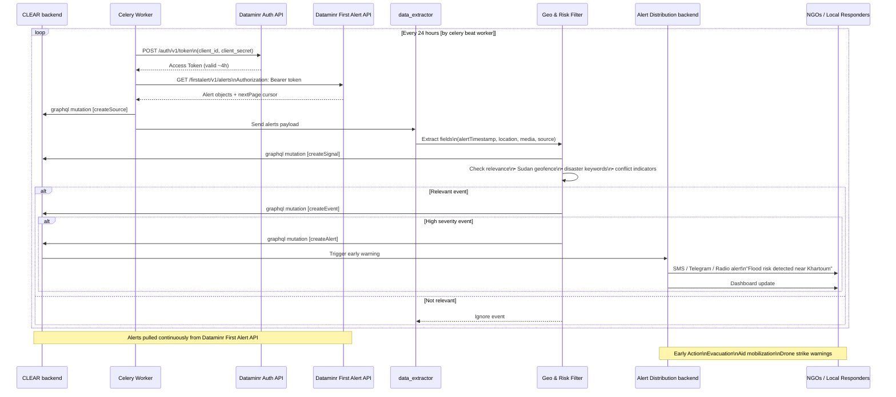

# CLEAR Pipeline — Architecture Diagram

## Full Pipeline Sequence Diagram

```mermaid
sequenceDiagram
    %% participant user as user
    participant backend as CLEAR backend
    participant celery as Celery Worker
    participant DataminrAuth as Dataminr Auth API
    participant DataminrAlerts as Dataminr First Alert API
    participant data_extractor as data_extractor
    participant GeoFilter as Geo & Risk Filter
    participant Notifier as Alert Distribution backend
    participant Users as NGOs / Local Responders

    %% user->>backend: Configure alert lists (Sudan topics: floods, conflict, drone strikes)


    loop Every 24 hours [by celery beat worker]
        celery->>DataminrAuth: POST /auth/v1/token\n(client_id, client_secret)
        DataminrAuth-->>celery: Access Token (valid ~4h)

        celery->>DataminrAlerts: GET /firstalert/v1/alerts\nAuthorization: Bearer token
        DataminrAlerts-->>celery: Alert objects + nextPage cursor

        celery->>backend: graphql mutation [createSource]

        celery->>data_extractor: Send alerts payload

        data_extractor->>GeoFilter: Extract fields\n(alertTimestamp, location, media, source)

        GeoFilter->>backend: graphql mutation [createSignal]

        GeoFilter->>GeoFilter: Check relevance\n• Sudan geofence\n• disaster keywords\n• conflict indicators


        alt Relevant event
            GeoFilter->>backend: graphql mutation [createEvent]

            alt High severity event
                GeoFilter->>backend: graphql mutation [createAlert]
                backend->>Notifier: Trigger early warning

                Notifier->>Users: SMS / Telegram / Radio alert\n"Flood risk detected near Khartoum"
                Notifier->>Users: Dashboard update
            end
        else Not relevant
            GeoFilter-->>data_extractor: Ignore event
        end
    end

    Note over backend,DataminrAlerts: Alerts pulled continuously from Dataminr First Alert API

    Note over Notifier,Users: Early Action\nEvacuation\nAid mobilization\nDrone strike warnings
```

---
