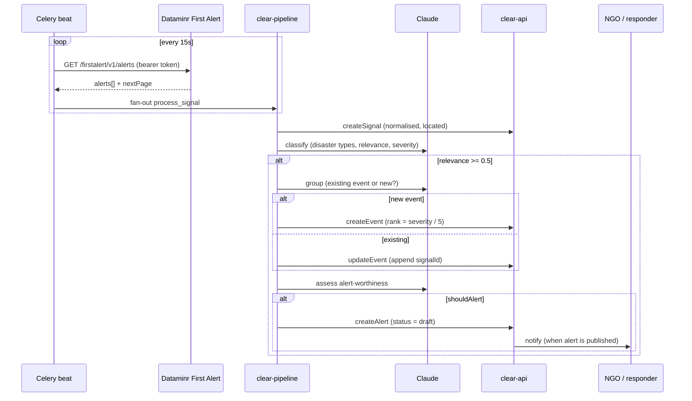

# CLEAR Data Pipeline — Source of Truth

> **Status:** v0.1 draft, for team review. Owner: James. Last updated: 2026-04-21.
>
> This document is the single place where we describe how data flows through CLEAR, what decisions the pipeline makes on our behalf, and which of those decisions are still open. If something in this doc disagrees with the code, the code is authoritative — please open a PR against `docs/DATA_PIPELINE.md` to reconcile.

## 1. Purpose

CLEAR turns a firehose of third-party observations into a small number of actionable alerts for NGOs and local responders. This doc answers three questions that are currently answered implicitly and differently in different people's heads:

1. **What is the pipeline?** The stages, what each one decides, and where the inputs and outputs live.
2. **What does "data" mean to us?** We keep calling many different things "data". They are not the same and should not be treated the same. Section 3 establishes a shared vocabulary.
3. **What are we assuming?** Every pipeline stage encodes hypotheses about the world. Section 7 lists them so they can be challenged.

### What this doc is not

- Not an API reference. The GraphQL schema is the reference — see `https://api.clearinitiative.io/docs`.
- Not a product roadmap. See the PRD.
- Not a public whitepaper (yet). It is an internal alignment artifact. Sections 3 and 7 are the bits we would eventually want to publish, once we have consensus.

## 2. Mental model

At the highest level, CLEAR has five stages. Everything else is an elaboration of one of these.

```
External source      Polling           Normalisation       ML reasoning         Distribution
─────────────        ─────────         ─────────────       ────────────         ────────────
Dataminr, ACLED,     Celery beat       Signal =            Classification  →    Alert (draft or
FEWS NET, wires ──►  every 15s   ──►   one raw     ──►     Event grouping  ──►  published) ──► NGOs,
                     (configurable)    observation         Alert assessment     responders,
                                                                                dashboard
```

Three nouns carry the whole system. Getting the distinction right is the most important outcome of this document.

| Term       | Definition                                                                              | Example                                                      |
| ---------- | --------------------------------------------------------------------------------------- | ------------------------------------------------------------ |
| **Signal** | A single raw observation as reported by a source. We do not alter its meaning.          | A Dataminr alert: "Reports of flooding near Khartoum, 14:03" |
| **Event**  | A coherent real-world situation that one or more signals refer to.                      | "Khartoum flooding, April 2026" — may have dozens of signals |
| **Alert**  | An event that has been deemed worth waking someone up for. May be `draft` or published. | The SMS that goes to a field team                            |

Dataminr calls its items "alerts". We do not. To us, a Dataminr alert is a **signal**. An Alert in CLEAR is the thing we decide to escalate — a separate concept with its own Claude gate.

### Reference implementation



See `src/tasks/poll.py`, `src/tasks/process.py`, and the services in `src/services/` for the canonical implementation.

## 3. What we mean by "data" — eight shapes

Different data shapes have different latency, different trust properties, and different useful lifetimes. Treating them indiscriminately has already caused us internal confusion. Using this list as shared vocabulary is part of the team-consensus goal of this doc.

| #   | Shape                                   | Latency      | Useful lifetime | Example                         | How CLEAR handles it today                                    |
| --- | --------------------------------------- | ------------ | --------------- | ------------------------------- | ------------------------------------------------------------- |
| 1   | Real-time human reporting               | seconds–mins | hours           | Newswires, Dataminr First Alert | **Primary signal source.** Polled every 15s.                  |
| 2   | Backward-looking curated reporting      | days–weeks   | months–years    | Reliefweb                       | Not ingested.                                                 |
| 3   | Specialist-analysed fastfollow updates  | hours–days   | weeks           | ACLED                           | Not ingested; on roadmap.                                     |
| 4   | Short-term behavioural forecasting      | hours–days   | days            | "X% of people will do Y if Z"   | Not produced or consumed.                                     |
| 5   | Medium-to-long-term risk forecasting    | weeks–months | season–year     | FEWS NET, IPC                   | Not ingested; on roadmap.                                     |
| 6   | Indices                                 | varies       | quarters–years  | INFORM Severity Index           | Not produced or consumed.                                     |
| 7   | Demographic / slow-changing metadata    | quarterly+   | years           | Population, admin boundaries    | PostGIS `locations` table (see §6).                           |
| 8   | Derived crystallised shapes             | very slow    | indefinite      | Codes of conduct, methodologies | Out of scope for the automated pipeline; lives in docs / PRs. |

Open vocabulary question for the team: are there shapes we should add (satellite imagery? Sensor readings? User-submitted reports?). This list is non-exhaustive on purpose.

## 4. Data sources

The DoD for the ticket calls for "a detailed datasource table, including purpose of the data, clarified access." This is the current state — it should be extended as we onboard sources.

| Source   | Shape (§3) | Purpose in CLEAR                      | Access                                            | Cadence                    | Geographic scope     | Status                 |
| -------- | ---------- | ------------------------------------- | ------------------------------------------------- | -------------------------- | -------------------- | ---------------------- |
| Dataminr | 1          | Primary real-time signal supply       | OAuth2 client credentials (`/auth/v1/token`)      | Poll every 15s, 7d backlog | Sudan (alert lists)  | **Live**               |
| GADM     | 7          | Admin boundaries for location resolve | Public dataset, loaded into `locations` (PostGIS) | One-off load               | Sudan (v1)           | Partial; see §6        |
| ACLED    | 3          | Fastfollow curated conflict data      | Keyed API                                         | TBD                        | Country-configurable | Planned                |
| FEWS NET | 5          | Food-security forecasts               | Public feeds                                      | Monthly                    | National             | Planned                |
| Claude   | n/a        | ML reasoning, not a data source       | Anthropic API                                     | Per-signal                 | —                    | Live (sonnet-4-6 v0.1) |

Rate limits we currently know about: Dataminr = 180 requests per 10 minutes. We are nowhere near this.

## 5. Pipeline stages

Each stage has a fixed contract: input type, decision logic, output type, config knobs, quality controls, open questions. These follow the code as of this writing.

### Stage 0 — Poll and deduplicate

- **Where:** `src/tasks/poll.py`
- **Input:** None (triggered by Celery beat).
- **Logic:** Refresh Dataminr token if stale (TTL 3.5h), fetch alerts for the time window, paginate via `nextPage` up to `MAX_PAGES_PER_POLL=50`, drop anything we have already seen (Redis `dataminr:seen:{alertId}`, 48h TTL), dispatch `process_signal` for each new item.
- **Output:** N fan-out tasks, one per new signal.
- **Time-window rule:** First run fetches `now - 7d`. Subsequent runs fetch from the latest `publishedAt` in the DB. No cursor is persisted — on restart we derive the boundary from clear-api. The practical implication: **if the pipeline is down for more than 7 days we will lose signals from the gap beyond day 7**.
- **Knobs:** `POLL_INTERVAL_SECONDS=15`, `INITIAL_LOOKBACK_DAYS=7`, `DEDUP_TTL_HOURS=48`.

### Stage 1 — Signal creation and location resolution

- **Where:** `src/services/signal.py`, `src/services/geo.py`
- **Input:** One Dataminr alert payload.
- **Logic:** Map Dataminr fields to CLEAR signal fields (`alertTimestamp` → `publishedAt`, `headline` → `title`, `subHeadline.*` → `description`, `publicPost.href` → `url`, full payload → `rawData`). Resolve `estimatedEventLocation.coordinates` to the nearest known CLEAR location.
- **Output:** A persisted CLEAR signal row (`createSignal` mutation).
- **Location resolution, current reality:** Implementation in `src/services/geo.py` uses a haversine fallback against cached locations. The intended production path is a PostGIS `ST_Distance` query via a `nearestLocation` GraphQL query on `clear-api` that is not yet wired up. **Today, spatial precision is limited by whatever is in the `locations` table for the country in scope.** For Sudan, GADM admin boundaries need loading (tracked as T7.1 in the PRD).
- **Knobs:** Grid-cache precision (0.1°) in `src/services/geo.py`.

### Stage 2 — Classification

- **Where:** `src/services/` → Claude call with prompt in `src/prompts/classify.py`.
- **Input:** Signal title, description, raw payload, resolved location name.
- **Logic:** Single Claude call that returns `{ disasterTypes[], relevance: 0-1, severity: 1-5, summary }`.
- **Output:** A classification object. Cached in Redis keyed by signal ID for 24h.
- **Gate:** If `relevance < RELEVANCE_THRESHOLD=0.5`, we stop here. The signal is persisted but does not progress to an event.

### Stage 3 — Event grouping

- **Where:** `src/services/event.py`
- **Input:** The classified signal + cached list of active events (`events:active`, 1h TTL).
- **Logic:** Claude chooses between `add_to_existing` (returning an `event_id`) and `create_new` (returning a proposed title, description, and disaster types).
- **Output:** Either an `updateEvent` call that appends the signal ID, or a `createEvent` call.
- **Time window for "active":** New events are created with `validFrom = signal.publishedAt` and `validTo = signal.publishedAt + 7 days`. This is the **signal-to-event association window** that the ticket flags as a founding-team consensus item: a signal can only attach to an event whose window it falls inside. Seven days is hardcoded. See §7 for why this is a load-bearing assumption.
- **Rank:** On create, `rank = severity / 5.0` (0.0–1.0). Severity comes from Stage 2. There is no recomputation as more signals attach.
- **Knobs:** Event cache TTL (1h), `validTo` offset (7d).

### Stage 4 — Alert assessment

- **Where:** `src/services/alert.py`
- **Input:** The event (post-create or post-update) plus summaries of its linked signals and the max severity observed.
- **Logic:** A Claude call that returns `{ shouldAlert, status }`. Prompt in `src/prompts/assess.py`.
- **Output:** If `shouldAlert`, a `createAlert` mutation is issued. Status is **always `draft` in v0.1** — no pipeline-generated alert auto-publishes; a human must promote it.
- **Knobs:** None currently exposed. The auto-publish decision is a deliberate v0 constraint, not a technical limitation.

## 6. Location: our current stance

The ticket asks "what is our standpoint on Location? How do we want to raster information?" The honest current answer:

- **Unit of truth:** the CLEAR `locations` table, hierarchical (country → state → locality), with PostGIS geometries where they are loaded.
- **Granularity:** as fine as the loaded admin boundaries allow. For Sudan v1 we are targeting GADM level 2 (localities). Everything else degrades to the coarsest available parent.
- **Rastering:** we do **not** currently grid the world into fixed cells. We snap incoming coordinates to the nearest admin area. Grids (H3, S2) have not been evaluated.
- **Gap:** the production `nearestLocation` PostGIS query is not yet implemented; the fallback in `src/services/geo.py` is placeholder-grade. Any analytical use of current location data should treat it as directional, not precise.

Open: do we want a raster layer alongside admin areas, for cases like "this flood crosses three boundaries"? See §8.

## 7. Underlying hypotheses

These are the assumptions currently encoded in the pipeline. Each one is a candidate for sector challenge and empirical validation. Flagged explicitly so we can probe them.

| #   | Hypothesis                                                                                                                                           | Where it lives                                       | How we would falsify it                                           |
| --- | ---------------------------------------------------------------------------------------------------------------------------------------------------- | ---------------------------------------------------- | ----------------------------------------------------------------- |
| H1  | **Seven days is a reasonable window in which a follow-up signal is still about the same event.**                                                     | `src/services/event.py` — `validTo = publishedAt+7d` | Measure signal-to-event miss rate at 3d, 7d, 14d on a labelled set. |
| H2  | **A single severity score (1–5) from one LLM call is sufficient signal for alert escalation.**                                                       | Stage 2, Stage 4                                     | Side-by-side comparison with a multi-factor score on the same events. |
| H3  | **A signal with `relevance < 0.5` is safely droppable.**                                                                                             | Stage 2 gate                                         | Audit dropped signals for false negatives against Reliefweb ground truth. |
| H4  | **An LLM can correctly decide "same event or new event" given a 1-hour-stale active-events cache.**                                                  | Stage 3                                              | Re-run grouping with fresh vs stale caches on the same signals.   |
| H5  | **Nearest admin area is the right spatial abstraction** (as opposed to a raster or a probability surface weighted by `probabilityRadius`).           | §6                                                   | Compare signal-to-event linkage quality under admin vs H3 grid.   |
| H6  | **Dataminr alone provides sufficient real-time coverage for Sudan.**                                                                                 | §4                                                   | Source-diversity study — how often does a Reliefweb or ACLED item appear before Dataminr? |
| H7  | **Event `rank = severity / 5` is a meaningful ordering for downstream consumers.**                                                                   | Stage 3                                              | User study with field teams on ranked event lists.                |
| H8  | **Signals do not need to be reclassified when an event gains more signals** (severity is set once, from the first qualifying signal, and not updated). | Stage 3                                              | Compare event severity over time with and without re-scoring.     |

Adding to this list is encouraged. Every hypothesis we surface is easier to disagree with than one that stays implicit.

## 8. Open questions for the team

These are decisions we have not made. Ticket text is preserved where it was already precise.

1. **One pipeline or many?** Do we want parallel pipelines (e.g. Sudan, Yemen) sharing infrastructure, or one multi-tenant pipeline with per-region config? How do we run experiments — shadow-mode pipeline reading the same inputs, or branch-per-experiment?
2. **Configurability surface.** What should be per-deployment configurable (`RELEVANCE_THRESHOLD`, event window, Claude model, prompts) vs. version-controlled code? Currently everything except the threshold requires a redeploy.
3. **Severity model.** What inputs should severity consider beyond signal text? Source reliability? Prior events in the area? Population affected? What do other humanitarian orgs we want to onboard already use?
4. **Feedback loops.** How do we feed back to Dataminr / upstream when their classification disagrees with ours? How do we feed downstream consumers' promote/suppress actions back into our model?
5. **Backfill policy.** Today if the pipeline is down for more than 7 days we lose the gap. Acceptable? Or do we want a configurable backfill-from-last-known-signal with no cap?
6. **Human-in-the-loop.** Alerts are `draft` by default. Who reviews? What is the SLA? What happens to an event whose alert sits in draft forever?
7. **Location rastering.** See §6 — admin areas only, or admin + grid?
8. **Observability.** What do we want on a dashboard, at what granularity, for whom? Oncall vs. leadership vs. field teams.

## 9. Maintaining this document

- **One source of truth rule.** Anything in this doc that conflicts with the code is a bug in the doc. PRs against `docs/DATA_PIPELINE.md` are expected when pipeline behaviour changes.
- **Review cadence.** Re-read end-to-end at the start of each cycle. If a section no longer reflects reality, open a PR before writing new features on top of it.
- **Challenge budget.** Every team member should be able to challenge any of §3, §6, §7, §8 at any time. The ticket's framing of "a whitepaper the sector can challenge" starts here, internally, first.

---

### Appendix A — Config quick reference

| Variable                | Default                                   | Meaning                                         |
| ----------------------- | ----------------------------------------- | ----------------------------------------------- |
| `POLL_INTERVAL_SECONDS` | 15                                        | Dataminr poll cadence                           |
| `INITIAL_LOOKBACK_DAYS` | 7                                         | First-run backlog                               |
| `DEDUP_TTL_HOURS`       | 48                                        | How long a seen alertId stays deduplicated      |
| `RELEVANCE_THRESHOLD`   | 0.5                                       | Minimum Claude relevance to progress past Stage 2 |
| `MAX_PAGES_PER_POLL`    | 50                                        | Safety cap on pagination per poll               |
| `CLAUDE_MODEL`          | `claude-sonnet-4-6`                       | Model used at all three ML stages               |
| Event `validTo` offset  | 7 days (hardcoded, `src/services/event.py`) | Signal-to-event association window              |
| Event `rank`            | `severity / 5.0`                          | Normalised 0–1 ordering                         |

### Appendix B — Related documents

- Pipeline PRD: `docs/PRD.md`
- Architecture diagram: `docs/ARCHITECTURE.md`
- Dataminr field reference: `docs/DataMinr.md`
- Public API docs (schema reference): `https://api.clearinitiative.io/docs`
