# ACLED: projected pipeline map (medallion rework, task 1/6)

Target-state mapping, scoped to **ACLED only** — second in the rollout
order (Dataminr → ACLED → Darfur24). Task 1: naming the target Dagster
assets, what each absorbs from today's code, and where each layer
persists. No GX suites (task 2/4), no ontology-object aggregation (task
3), no integration tests (task 6) here.

Objective: decouple the pipeline from clear-api's database and persist
more often. Bronze, silver, and gold all become real, inspectable S3
artifacts before anything reaches clear-api, and the push to clear-api
becomes incremental — driven off what's new in the gold layer, not a full
replay every run.

## 1. Target architecture, scoped to ACLED

```mermaid
flowchart LR
    ACLED["ACLED<br/>/api/acled/read, per country"] -->|poll| GXb["GX bronze check"]
    GXb --> Bronze["Bronze: S3<br/>raw/acled/&lt;date&gt;/&lt;acledId&gt;.json<br/>unchanged from today"]
    Bronze --> GXs["GX silver check"]
    GXs -->|pass| Silver["Silver: S3<br/>silver/acled/&lt;date&gt;/&lt;acledId&gt;.json<br/>cleansed, no clear-api write"]
    GXs -.->|suite failure| BlockS["block: never becomes silver"]

    Silver --> Cls["Classify"]
    Cls --> Geo["Geo"]
    Geo --> Time["Temporal"]
    Time --> Match["Match & merge"]

    Match --> GXg["GX gold check"]
    GXg -->|pass| Gold["Gold: S3<br/>signals table + events table<br/>pushedAt cursor per row"]
    GXg -.->|suite failure| BlockG["block: never marked ready"]
    Gold -->|incremental push:<br/>rows where pushedAt is null| ClearAPI["clear-api Postgres<br/>serving store, decoupled"]
```



`Classify → Geo → Temporal → Match & merge` is the same shared business
logic Dataminr's silver artifact already feeds — ACLED's silver artifact
joins the same chain, consolidating across sources at the gold boundary.
The work specific to this task is bronze → silver, and the S3 persistence
shape below.

## 2. Target steps and what each absorbs from today

| Target Dagster asset | Does | Absorbs from today's code | GX gate |
|---|---|---|---|
| `acled_bronze` | Authenticate (session cookies, 23h Redis cache), fetch per configured country over an overscanned date window (event_date lags publication), write the **untouched raw event** to S3 | `providers/acled.py::_authenticate`, `_fetch_for_country`, the `event_date`-lag overscan in `fetch_acled_events` — same fetch, but bronze now writes the raw dict only, not the pre-normalized one (see §4) | shape check: required keys present (`event_id_cnty`/`event_id`/`data_id`, `event_date`), non-empty batch per country |
| `acled_silver` | Normalize: severity ladder from fatalities, event/disorder-type → glide mapping, title/description assembly, geo-enrich — write a cleansed record to S3, **no `createSignal` call** | `providers/acled.py::_parse_event`, `build_acled_signal_input`, `providers/signal.py::enrich_with_geoparser` — same logic, different destination | completeness (title/description non-null), severity in [1,5], `fatalities` non-negative, coords in-range when present |
| `acled_classify` | Relevance + event type (shared phase) | `providers/classify.py::classify_locally` — unchanged, pure transform over the silver artifact | relevance/type populated (observational) |
| `acled_geo` | Admin-2 district resolution (shared phase) | `providers/event.py::group_signal` → `resolve_signal_admin2` — same resolution, reads the silver artifact instead of a clear-api-created signal row | district-resolution rate (observational) |
| `acled_temporal` | Active-window match eligibility (shared phase) | `providers/event.py::group_signal`'s active-window filter — same window logic, over in-memory candidates | new-vs-merged ratio drift (observational) |
| `acled_match` | Create-or-merge into a gold-shaped `Event`, no clear-api write yet | `providers/event.py::_match_and_act`, `_rewrite_event`, `_compute_event_severity`, `_merge_event_stats` — same consolidation, output is an in-memory object | — (feeds the gold gate directly) |
| `acled_gold` | Write the finished, GX-gated signal row + event row to the gold tables (§3) | new: today this state only exists implicitly inside `_match_and_act`'s return value and the separate `alert` stage's severity gate | referential integrity, aggregate bounds (`populationAffected`, `severity` range) |
| `acled_push` | Read gold rows where `pushedAt IS NULL`, call the matching clear-api mutations, mark them pushed | replaces `providers/clear_api.py::create_signal` (today's early write) **and** the incremental `update_event`/`create_event`/`escalate_to_alert` calls | — (the incremental filter is the gate's payoff: nothing already-pushed gets resent) |

## 3. S3 persistence: silver and gold

Same shape as the rest of the rollout, `acled`-prefixed.

**Bronze** — one file per raw event, keyed by ACLED's own id, unchanged
from today's key convention:
```
raw/acled/<date>/<acledId>.json
```

**Silver** — one file per source record, same partitioning:
```
silver/acled/<date>/<acledId>.json
```
Content: the cleansed record (`_parse_event` + `build_acled_signal_input` +
`enrich_with_geoparser` output shape) — normalized title/description,
severity from the fatalities ladder, glide type, fatalities count,
resolved or source-supplied coordinates. No event/district fields yet.

**Gold signals table** — one file per signal that reached gold, keyed by
`acledId`, rewritten in place once pushed:
```
gold/acled/signals/<acledId>.json
```
```json
{
  "acledId": "…",
  "eventId": "…",
  "relevanceScore": 0.81,
  "eventType": "conflict",
  "districtId": "…",
  "matchOutcome": "new_event | merged",
  "populationAffectedContribution": null,
  "casualtiesContribution": 4,
  "createdAt": "2026-09-09T12:00:00Z",
  "pushedAt": null
}
```

**Gold events table** — one file per gold event, keyed by `eventId`,
overwritten as new signals merge into it:
```
gold/acled/events/<eventId>.json
```
Content: the current consolidated `Event` shape (title, description,
severity, population, signalIds, startedAt, …) — the same fields
`_match_and_act` already assembles today, landing in S3 instead of an
inline `update_event`/`create_event` call.

**Incremental push cursor.** `acled_push` lists `gold/acled/signals/` rows
with `pushedAt IS NULL`, resolves each one's `eventId`, pushes the signal
(create) and its event (create-or-merge, referencing whichever rows in
`gold/acled/events/` those signals point to), escalates to alert when the
pushed event's severity crosses the threshold, then rewrites each pushed
signal row with `pushedAt = now()`. A failed push leaves the row
`pushedAt: null` for retry next run — safe given clear-api's existing
idempotent `createSignal` upsert and `createAlert` per-`eventId`
idempotency.

## 4. What actually changes vs. today, for ACLED specifically

- **Bronze becomes the truly raw payload.** Today, `raw_bytes()` writes the
  *already-parsed* dict (title, severity, glide_type, … with the untouched
  API response nested under `event["raw"]`) — `_parse_event` runs inside
  `fetch_acled_events`, before the bronze write. Under the target
  architecture, bronze should store `event["raw"]` only, and everything
  `_parse_event` currently derives (severity ladder, glide mapping, title/
  description assembly) moves into `acled_silver`. This is a real
  boundary fix for ACLED, not just a relocation — today's bronze blob
  already carries derived fields a schema-drift check can't cleanly
  distinguish from source data.
- **Two dedup layers collapse into the S3 key.** Today: an in-batch id
  set, a Redis seen-set (`acled:seen:<id>`, marked via `post_create` only
  after `createSignal` succeeds), and clear-api's `(sourceId, externalId)`
  upsert as the final backstop. Next state: the `acledId`-keyed S3 path is
  what makes reprocessing idempotent at bronze/silver; the Redis seen-set
  can still gate the *poll* itself (unchanged, operational) but no longer
  needs to gate persistence.
- **Publication-lag overscan stays, unchanged.** ACLED's `event_date`
  lagging publication is a source-API quirk independent of medallion
  layering — `acled_bronze`'s poll window keeps overscanning by
  `acled_publication_lag_days`, same as today.
- **Classify/geo/temporal stop round-tripping clear-api.** No
  `pendingSignals` read, no per-signal Redis lock for cross-worker
  consolidation ordering — concurrency control moves inside the Dagster
  run instead of across clear-api reads.
- **Push becomes incremental, not eager.** Today: `createSignal` fires per
  polled record, then `update_event`/`create_event` fires inline
  mid-consolidation, then `escalate_to_alert` fires once severity crosses
  the threshold — three separate write moments per signal. Next state:
  nothing reaches clear-api until `acled_push` runs, and it only ever
  processes gold rows with `pushedAt IS NULL`.
- **Crisis stays out of scope for this push.** Crisis enrichment is a
  separate, source-agnostic downstream stage fed by `Event`; `acled_gold`
  produces `Event`/`Alert`-shaped rows only.

## 5. Not covered here

- Quality rules / blocking vs. non-blocking thresholds per gate → task 2.
- Aggregations for additional business-object types beyond
  Signal/Event/Alert → task 3.
- Concrete GX expectation suites (expectations, thresholds) → task 4.
- Integration tests against real S3/clear-api → task 6.
