# Darfur24: projected pipeline map (medallion rework, task 1/6)

Target-state mapping, scoped to **Darfur24 only** — third in the rollout
order (Dataminr → ACLED → Darfur24). Task 1: naming the target Dagster
assets, what each absorbs from today's code, and where each layer
persists. No GX suites (task 2/4), no ontology-object aggregation (task
3), no integration tests (task 6) here.

Objective: decouple the pipeline from clear-api's database and persist
more often. Bronze, silver, and gold all become real, inspectable S3
artifacts before anything reaches clear-api, and the push to clear-api
becomes incremental — driven off what's new in the gold layer, not a full
replay every run.

## 1. Target architecture, scoped to Darfur24

```mermaid
flowchart LR
    D24["Darfur24<br/>WordPress RSS, full feed"] -->|poll| GXb["GX bronze check"]
    GXb --> Bronze["Bronze: S3<br/>raw/darfur24/&lt;date&gt;/&lt;slug&gt;.json<br/>unchanged from today"]
    Bronze --> GXs["GX silver check"]
    GXs -->|pass| Silver["Silver: S3<br/>silver/darfur24/&lt;date&gt;/&lt;slug&gt;.json<br/>cleansed, no clear-api write"]
    GXs -.->|suite failure| BlockS["block: never becomes silver"]

    Silver --> Cls["Classify"]
    Cls --> Geo["Geo"]
    Geo --> Time["Temporal"]
    Time --> Match["Match & merge"]

    Match --> GXg["GX gold check"]
    GXg -->|pass| Gold["Gold: S3<br/>signals table + events table<br/>pushedAt cursor per row"]
    GXg -.->|suite failure| BlockG["block: never marked ready"]
    Gold -->|incremental push:<br/>rows where pushedAt is null| ClearAPI["clear-api Postgres<br/>serving store, decoupled"]
```



`Classify → Geo → Temporal → Match & merge` is the same shared business
logic Dataminr's and ACLED's silver artifacts already feed — Darfur24's
silver artifact joins the same chain, consolidating across sources at the
gold boundary. The work specific to this task is bronze → silver, and the
S3 persistence shape below.

## 2. Target steps and what each absorbs from today

| Target Dagster asset | Does | Absorbs from today's code | GX gate |
|---|---|---|---|
| `darfur24_bronze` | Fetch each configured RSS feed (English edition by default), parse XML items, write the **untouched raw item** to S3 | `providers/darfur24.py::_fetch_feed`, `_parse_item` — same fetch, but bronze now writes the raw item fields only, not the pre-stripped one (see §4) | shape check: required keys present (`link`, `title`), non-empty item list per feed |
| `darfur24_silver` | Normalize: strip WordPress HTML/footer boilerplate, extract slug from the permalink, resolve the fixed country-level (L0) location, fixed informational severity — write a cleansed record to S3, **no `createSignal` call** | `providers/darfur24.py::_strip_html`, `_slug_from_link`, `build_darfur24_signal_input` — same logic, different destination | completeness (title non-null, description mostly non-null), severity == 1 (fixed for this source), `slug` non-null and unique within the batch |
| `darfur24_classify` | Relevance + event type (shared phase) | `providers/classify.py::classify_locally` — unchanged, pure transform over the silver artifact | relevance/type populated (observational) |
| `darfur24_geo` | Admin-2 district resolution (shared phase) — expected low resolution rate for this source, see §4 | `providers/event.py::group_signal` → `resolve_signal_admin2` — same resolution, reads the silver artifact instead of a clear-api-created signal row | district-resolution rate (observational, source-aware baseline — see §4) |
| `darfur24_temporal` | Active-window match eligibility (shared phase) | `providers/event.py::group_signal`'s active-window filter — same window logic, over in-memory candidates | new-vs-merged ratio drift (observational) |
| `darfur24_match` | Create-or-merge into a gold-shaped `Event`, no clear-api write yet | `providers/event.py::_match_and_act`, `_rewrite_event`, `_compute_event_severity`, `_merge_event_stats` — same consolidation, output is an in-memory object | — (feeds the gold gate directly) |
| `darfur24_gold` | Write the finished, GX-gated signal row + event row to the gold tables (§3) | new: today this state only exists implicitly inside `_match_and_act`'s return value and the separate `alert` stage's severity gate | referential integrity, aggregate bounds (`severity` fixed at 1, so this gate mostly checks the event side) |
| `darfur24_push` | Read gold rows where `pushedAt IS NULL`, call the matching clear-api mutations, mark them pushed | replaces `providers/clear_api.py::create_signal` (today's early write) **and** the incremental `update_event`/`create_event`/`escalate_to_alert` calls | — (the incremental filter is the gate's payoff: nothing already-pushed gets resent) |

## 3. S3 persistence: silver and gold

Same shape as the rest of the rollout, `darfur24`-prefixed. The slug from
the article's permalink is the stable id (already used as `externalId`
today: `darfur24:<slug>`), so it's the natural S3 key.

**Bronze** — one file per raw RSS item, keyed by slug:
```
raw/darfur24/<date>/<slug>.json
```

**Silver** — one file per source record, same partitioning:
```
silver/darfur24/<date>/<slug>.json
```
Content: the cleansed record (`_parse_item` + `build_darfur24_signal_input`
output shape) — normalized title/description (HTML/footer stripped),
fixed `severity: 1`, resolved country-level `locationId`. No coordinates,
no casualties, no district — this source carries none of those, by
design (news text only, not structured event data).

**Gold signals table** — one file per signal that reached gold, keyed by
`slug`, rewritten in place once pushed:
```
gold/darfur24/signals/<slug>.json
```
```json
{
  "slug": "…",
  "eventId": "…",
  "relevanceScore": 0.64,
  "eventType": "conflict",
  "districtId": null,
  "matchOutcome": "new_event | merged",
  "populationAffectedContribution": null,
  "casualtiesContribution": null,
  "createdAt": "2026-09-09T12:00:00Z",
  "pushedAt": null
}
```

**Gold events table** — one file per gold event, keyed by `eventId`,
overwritten as new signals merge into it:
```
gold/darfur24/events/<eventId>.json
```
Content: the current consolidated `Event` shape (title, description,
severity, population, signalIds, startedAt, …) — the same fields
`_match_and_act` already assembles today, landing in S3 instead of an
inline `update_event`/`create_event` call.

**Incremental push cursor.** `darfur24_push` lists `gold/darfur24/signals/`
rows with `pushedAt IS NULL`, resolves each one's `eventId`, pushes the
signal (create) and its event (create-or-merge, referencing whichever rows
in `gold/darfur24/events/` those signals point to), escalates to alert
when the pushed event's severity crosses the threshold, then rewrites each
pushed signal row with `pushedAt = now()`. A failed push leaves the row
`pushedAt: null` for retry next run — safe given clear-api's existing
idempotent `createSignal` upsert and `createAlert` per-`eventId`
idempotency.

## 4. What actually changes vs. today, for Darfur24 specifically

- **Bronze becomes the truly raw payload.** Today, `raw_bytes()` writes the
  *already-parsed* dict (stripped title/description, extracted slug, with
  the untouched RSS item fields nested under `article["raw"]`) —
  `_parse_item` runs inside `fetch_darfur24_articles`, before the bronze
  write. Under the target architecture, bronze should store `article["raw"]`
  only, and everything `_parse_item` currently derives (HTML stripping,
  slug extraction, boilerplate removal) moves into `darfur24_silver`. Same
  boundary fix as ACLED.
- **No time-window semantics to preserve.** Unlike Dataminr/ACLED,
  `poll(since)` ignores `since` entirely — the RSS feed only ever serves
  its latest ~10 items, so there's no watermark-driven query window.
  `darfur24_bronze` keeps the same full-feed-every-poll behavior; the
  existing "informational only" watermark (`set_last_synced`, never read
  back for filtering) can stay exactly as-is or be dropped — it does no
  work today beyond observability.
- **Geo consolidation will show a low resolution rate for this source, by
  design.** Darfur24 signals carry no coordinates and are never
  geoparsed (`build_darfur24_signal_input` sets only the country-level L0
  location) — `resolve_signal_admin2` has nothing finer to work from. This
  isn't a defect to fix; it means the `darfur24_geo` observational check
  needs a source-aware baseline instead of Dataminr/ACLED's expectation
  (task 2's call, flagged here so it isn't misread as drift once the check
  exists).
- **Dedup collapses into the S3 key**, same as ACLED: today's Redis
  seen-set (`darfur24:seen:<slug>`, marked via `post_create` only after
  `createSignal` succeeds) plus clear-api's `(sourceId, externalId)`
  upsert as backstop. Next state: the `slug`-keyed S3 path makes
  reprocessing idempotent at bronze/silver; the Redis seen-set can still
  gate the *poll* itself (unchanged, operational).
- **Classify/geo/temporal stop round-tripping clear-api.** No
  `pendingSignals` read, no per-signal Redis lock for cross-worker
  consolidation ordering — concurrency control moves inside the Dagster
  run instead of across clear-api reads.
- **Push becomes incremental, not eager.** Today: `createSignal` fires per
  polled article, then `update_event`/`create_event` fires inline
  mid-consolidation, then `escalate_to_alert` fires if severity crosses
  the threshold (unlikely at the fixed severity floor of 1, but the code
  path exists). Next state: nothing reaches clear-api until
  `darfur24_push` runs, and it only ever processes gold rows with
  `pushedAt IS NULL`.
- **Crisis stays out of scope for this push.** Crisis enrichment is a
  separate, source-agnostic downstream stage fed by `Event`; `darfur24_gold`
  produces `Event`/`Alert`-shaped rows only.

## 5. Not covered here

- Quality rules / blocking vs. non-blocking thresholds per gate, including
  the source-aware geo-resolution baseline flagged above → task 2.
- Aggregations for additional business-object types beyond
  Signal/Event/Alert → task 3.
- Concrete GX expectation suites (expectations, thresholds) → task 4.
- Integration tests against real S3/clear-api → task 6.
