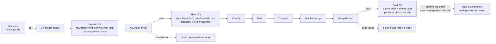

# Dataminr: projected pipeline map (medallion rework, task 1/6)

Target-state mapping, scoped to **Dataminr only** — first in the rollout
order (Dataminr → ACLED → Darfur24). Task 1: naming the target Dagster
assets, what each absorbs from today's code, and where each layer persists.
No GX suites (task 2/4), no ontology-object aggregation (task 3), no
integration tests (task 6) here.

Objective: decouple the pipeline from clear-api's database and persist
more often. Bronze, silver, and gold all become real, inspectable S3
artifacts before anything reaches clear-api, and the push to clear-api
becomes incremental — driven off what's new in the gold layer, not a full
replay every run.

## 1. Target architecture, scoped to Dataminr



`Classify → Geo → Temporal → Match & merge` is shared business logic —
Dataminr's silver artifact feeds the same phases ACLED and Darfur24 will
feed later, consolidating across sources at the gold boundary. Nothing in
that stretch is Dataminr-specific once silver exists; the work specific to
this task is bronze → silver, and the S3 persistence shape below.

## 2. Target steps and what each absorbs from today

| Target Dagster asset | Does | Absorbs from today's code | GX gate |
|---|---|---|---|
| `dataminr_bronze` | Poll (current API + legacy fallback), rate-limit, dedup against seen-set, write raw blob to S3 | `providers/dataminr.py::fetch_signals`, `defs/signals/lake.py::write_raw` — **unchanged**, already bronze today | shape check: required keys present (`alertId`, `alertTimestamp`), non-empty batch |
| `dataminr_silver` | Normalize (severity/casualties/description) + geo-enrich, write a cleansed record to S3 — **no `createSignal` call** | `providers/signal.py::build_signal_input`, `enrich_with_geoparser` — same logic, different destination | completeness (title/description mostly non-null), severity in [1,5], coords in-range when present |
| `dataminr_classify` | Relevance + event type (shared phase) | `providers/classify.py::classify_locally` — unchanged code, now a pure transform over the silver artifact | relevance/type populated (observational) |
| `dataminr_geo` | Admin-2 district resolution (shared phase) | `providers/event.py::group_signal` → `resolve_signal_admin2` — same resolution, reads the silver artifact instead of a clear-api-created signal row | district-resolution rate (observational) |
| `dataminr_temporal` | Active-window match eligibility (shared phase) | `providers/event.py::group_signal`'s active-window filter — same window logic, over in-memory candidates instead of a clear-api read | new-vs-merged ratio drift (observational) |
| `dataminr_match` | Create-or-merge into a gold-shaped `Event`, no clear-api write yet | `providers/event.py::_match_and_act`, `_rewrite_event`, `_compute_event_severity`, `_merge_event_stats` — same consolidation, output is an in-memory object | — (feeds the gold gate directly) |
| `dataminr_gold` | Write the finished, GX-gated signal row + event row to the gold tables (§3) | new: today this state only exists implicitly inside `_match_and_act`'s return value and the separate `alert` stage's severity gate | referential integrity, aggregate bounds (`populationAffected`, `severity` range) |
| `dataminr_push` | Read gold rows where `pushedAt IS NULL`, call the matching clear-api mutations, mark them pushed | replaces `providers/clear_api.py::create_signal` (today's early write) **and** the incremental `update_event`/`create_event`/`escalate_to_alert` calls | — (the incremental filter is the gate's payoff: nothing already-pushed gets resent) |

Naming convention (`dataminr_<layer>`) is proposed here so ACLED/Darfur24
follow the same pattern (`acled_bronze`, `acled_silver`, …) — keeps the
asset graph legible per source while the business-logic phases stay
literally the same functions across sources.

## 3. S3 persistence: silver and gold

Bronze's existing layout (`raw/<source>/<date>/<externalId>.json`, one file
per source record) is the pattern silver reuses. Gold needs two separate
tables because a gold `Event` is a long-lived, mutating aggregate (it keeps
absorbing new signals over its active window) while a gold `Signal` row is
written once and only gains a `pushedAt` timestamp later.

**Silver** — one file per source record, same partitioning as bronze:
```
silver/dataminr/<date>/<alertId>.json
```
Content: the cleansed record (`build_signal_input` + `enrich_with_geoparser`
output shape) — normalized title/description/severity/casualties, resolved
or source-supplied coordinates, no event/district fields yet.

**Gold signals table** — one file per signal that reached gold, keyed by
`alertId` (not date-partitioned, since its `pushedAt` field is rewritten
in place after a successful push):
```
gold/dataminr/signals/<alertId>.json
```
```json
{
  "alertId": "…",
  "eventId": "…",
  "relevanceScore": 0.87,
  "eventType": "conflict",
  "districtId": "…",
  "matchOutcome": "new_event | merged",
  "populationAffectedContribution": 1200,
  "casualtiesContribution": 3,
  "createdAt": "2026-09-09T12:00:00Z",
  "pushedAt": null
}
```

**Gold events table** — one file per gold event, keyed by `eventId`,
overwritten as new signals merge into it:
```
gold/dataminr/events/<eventId>.json
```
Content: the current consolidated `Event` shape (title, description,
severity, population, signalIds, startedAt, …) — the same fields
`_match_and_act` already assembles today, just landing in S3 instead of an
inline `update_event`/`create_event` call.

**Incremental push cursor.** `dataminr_push` lists `gold/dataminr/signals/`
rows with `pushedAt IS NULL`, resolves each one's `eventId`, pushes the
signal (create) and its event (create-or-merge, referencing whichever rows
in `gold/dataminr/events/` those signals point to), escalates to alert when
the pushed event's severity crosses the threshold, then rewrites each
pushed signal row with `pushedAt = now()`. Mirrors the existing
poll-watermark pattern: the cursor (here, per-row `pushedAt` rather than a
single timestamp, since gold rows arrive out of order across concurrent
match runs) only advances after a confirmed clear-api write, so a failed
push leaves the row `pushedAt: null` and it's retried next run — no
double-push risk given clear-api's existing idempotent `createSignal`
upsert and `createAlert` per-`eventId` idempotency.

Per-object overwrite with no cross-run locking is fine at this volume; add
a real index/manifest if listing `gold/dataminr/signals/` for unpushed rows
ever gets expensive at scale.

## 4. What actually changes vs. today, for Dataminr specifically

- **Silver stops being a clear-api write.** `create_signal` (idempotent
  upsert on `(sourceId, externalId)`) disappears from the hot path; the S3
  key (`alertId`-keyed) is now what makes reprocessing idempotent.
- **Classify/geo/temporal stop round-tripping clear-api.** No
  `pendingSignals` read, no per-signal Redis lock for cross-worker
  consolidation ordering — concurrency control moves inside the Dagster
  run instead of across clear-api reads.
- **Push becomes incremental, not eager.** Today: `createSignal` fires the
  moment a signal is polled, then `update_event`/`create_event` fires
  inline mid-consolidation, then `escalate_to_alert` fires once severity
  crosses the threshold — three separate write moments per signal. Next
  state: nothing reaches clear-api until `dataminr_push` runs, and it only
  ever processes gold rows with `pushedAt IS NULL`.
- **Crisis stays out of scope for this push.** Crisis enrichment is a
  separate, source-agnostic downstream stage fed by `Event`; `dataminr_gold`
  produces `Event`/`Alert`-shaped rows only.

## 5. Not covered here

- Quality rules / blocking vs. non-blocking thresholds per gate → task 2.
- Aggregations for additional business-object types beyond
  Signal/Event/Alert → task 3.
- Concrete GX expectation suites (expectations, thresholds) → task 4.
- Integration tests against real S3/clear-api → task 6.
