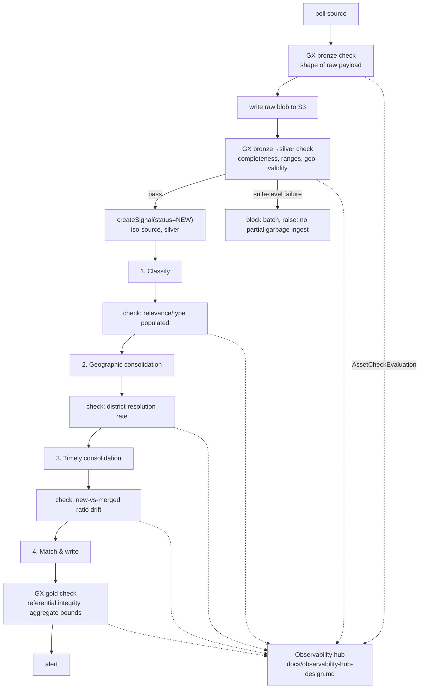
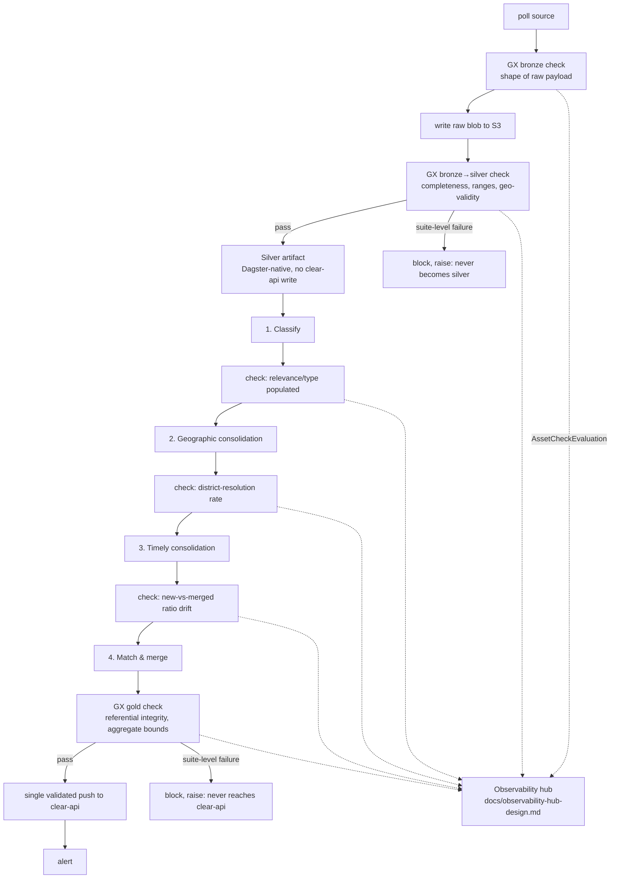

# Spec: Data quality for the signals ingestion pipeline (bronze → silver → gold)

## 1. Problem / scope

This doc covers **structural data quality on the signals ingestion
pipeline** (Dataminr / GDACS / ACLED / IDMC / manual → `Signal` → `Event` →
`Alert` → `Crisis`). This is the classic data-engineering concern: is a batch
schema-conformant, complete, fresh, deduplicated, and referentially sound.
It answers "is this batch of data structurally sound enough to trust the
pipeline that produced it." That's a different question from the
figure-credibility score, and orthogonal to it.

It describes two states. §2 is the **current** architecture, where silver
and gold live inside clear-api's Postgres. §2a is the **next state**
(proposed): silver, gold, and all cross-record business logic move into
Dagster itself, so clear-api receives only finished, already-validated
objects and stops being where aggregation happens. Every section after §2a
is written to cover both states, current first, next state called out
explicitly.

/!\ Note: this is **a different concern** from `docs/data-quality-scoring-design.md`,
which scores the **trustworthiness of humanitarian
figures extracted from Reports** (ReliefWeb PDFs → structured datapoints):
an LLM-assessed credibility score weighted by source reliability. It answers
"how much should we trust this number."

Today, quality is handled ad hoc:

- `factory.py`'s ingest loop isolates per-record failures in
  `try/except` scopes, counting `created`/`failed`. A failure isn't
  categorized (missing field? out-of-range value? upstream schema drift?),
  just logged and counted.
- Redis content-hash dedup (per connector, e.g. `idmc.py`'s
  `_content_hash`) catches exact re-ingestion, not statistical drift. A
  source suddenly sending 90% null coordinates isn't detected anywhere.
- `stages.py`'s `classify_group` retries a failing signal up to 5 times
  before marking it `FAILED`. This is a resilience mechanism, not a quality gate.

None of this is *declarative* or *queryable*. There's no suite of
expectations a reviewer can read to know what "good data" means at each
stage, and no systematic signal when a source's data quietly degrades
without individual records actually erroring.

## 2. Medallion mapping: current state

The pipeline doesn't have physical silver/gold tables of its own today.
Only bronze is a real, owned storage layer. Silver and gold live inside
**clear-api's** Postgres, reached only through GraphQL. That's a real
constraint on where DQ tooling can plug in, see §4.

```mermaid
flowchart LR
    subgraph Bronze["Bronze: owned by this repo"]
        S3["S3 raw blobs<br/>raw/&lt;source&gt;/&lt;date&gt;/&lt;id&gt;.json<br/>lake.py"]
    end
    subgraph Silver["Silver: iso-source, clear-api Postgres via GraphQL only"]
        Sig["Signal rows<br/>normalized, cleansed, geo-resolved<br/>ONE row per source record<br/>status: NEW"]
    end
    subgraph BL["Silver to Gold business logic: classify_group"]
        direction LR
        Cls["Classify<br/>relevance + type"] --> Geo["Geographic<br/>consolidation<br/>district resolution"]
        Geo --> Time["Timely<br/>consolidation<br/>active-window match"]
        Time --> Match["Match & write<br/>create or merge into Event"]
    end
    subgraph Gold["Gold: clear-api Postgres, via GraphQL only"]
        Evt["Event"] --> Alt["Alert"]
        Evt --> Cri["Crisis"]
    end

    Sources["Dataminr / GDACS / ACLED / IDMC / manual"] -->|poll| S3
    S3 -->|createSignal| Sig
    Sig --> Cls
    Match --> Evt
```



- **Bronze**: raw source payloads, exactly as fetched, untouched.
- **Silver**: `Signal` rows after connector-side normalization
  (`to_signal_input`) and geo-resolution (`enrich_with_geoparser`).
  **Strictly iso-source**: one row per source record, deduplicated only
  against exact re-polls of *the same source* (the redis content-hash
  check), never merged, matched, or clustered with a record from another
  source or another signal. This is the schema-conformed, cleansed
  layer, nothing more. Consolidation is explicitly not silver's job.
- **Silver to Gold business logic**: where cross-record, cross-source
  consolidation actually happens. Today this is one function,
  `providers/event.py`'s `group_signal` (called from `stages.py`'s
  `classify_group`). It already does three distinct things inline:
  classify (relevance + type, via `classify_locally`), resolve to an
  admin-2 **district** (geographic consolidation), and match only against
  events touched within the active window, `ACTIVE_EVENTS_WINDOW_DAYS`
  (temporal consolidation), before deciding to create a new `Event` or
  merge into an existing one. Each of these three steps reads or writes
  clear-api directly, mid-consolidation: `pendingSignals` to read the
  queue, then an inline create-or-merge write for the matched `Event`.
  §3a proposes making these phases explicit (for their own DQ
  checkpoints), not necessarily separate Dagster assets. See the note
  there on that trade-off.
- **Gold**: `Event`/`Alert`/`Crisis`, the output of the business-logic
  pipeline above, further escalated (severity-gated alerts) and enriched
  (crisis narrative/scenarios/needs). This is what `clear-mvp`'s dashboard
  actually reads.

## 2a. Medallion mapping: next state (proposed)

Today, clear-api's database is where consolidation happens: silver rows
land there via `createSignal`, and the classify/geo/temporal/match logic
reads and writes clear-api mid-consolidation, one round trip per step.
The next state moves that work into Dagster, so clear-api stops
aggregating and becomes a pure serving store.

```mermaid
flowchart LR
    subgraph Bronze["Bronze: owned by this repo, unchanged, replayable"]
        S3["S3 raw blobs<br/>raw/&lt;source&gt;/&lt;date&gt;/&lt;id&gt;.json<br/>lake.py"]
    end
    subgraph Silver["Silver: Dagster-native, GX-gated"]
        Sig["Cleansed, normalized records<br/>ONE row per source record<br/>no clear-api write yet"]
    end
    subgraph BL["Silver to Gold business logic, entirely in Dagster"]
        direction LR
        Cls["Classify<br/>relevance + type"] --> Geo["Geographic<br/>consolidation"]
        Geo --> Time["Temporal<br/>consolidation"]
        Time --> Match["Match & merge<br/>into a Gold object"]
    end
    subgraph Gold["Gold: Dagster-native, GX-gated"]
        GObj["Finished Event / Alert / Crisis objects<br/>ready to serve, still not in clear-api"]
    end

    Sources["Dataminr / GDACS / ACLED / IDMC / manual"] -->|poll| S3
    S3 -->|GX bronze check| Sig
    Sig -->|GX silver check| Cls
    Match -->|GX gold check| GObj
    GObj -->|single validated push| ClearAPI["clear-api Postgres<br/>pure serving store"]
```



What changes, layer by layer:

- **Bronze** stays exactly as it is. S3 raw blobs remain the replay point:
  nothing about ingestion or the lake changes.
- **Silver** stops being a clear-api write. Cleansing and normalization
  (today's `to_signal_input` + `enrich_with_geoparser`) still happen, but
  the output is a Dagster-native artifact, GX-gated on the way in, not a
  `createSignal` call. No signal reaches clear-api at this point.
- **Silver to Gold business logic** stops round-tripping clear-api at
  each substep. Classify, geographic consolidation, temporal
  consolidation, and match-and-merge (§3a) all run as pure transformations
  over the Dagster-native silver artifact. `pendingSignals` and the inline
  Event create-or-merge write disappear: there's nothing in clear-api to
  read yet, and nothing to write until the object is finished.
- **Gold** becomes a Dagster-native artifact too: a finished, GX-gated
  `Event`/`Alert`/`Crisis`-shaped object, fully resolved (district, time
  window, aggregates) before clear-api ever sees it.
- **The push to clear-api** happens exactly once per finished gold
  object, as a validated batch write, instead of the current pattern of
  an early `createSignal` followed by incremental Event
  creates/merges and alert escalations as consolidation proceeds.

The payoff: clear-api's database moves from doing aggregation (matching,
merging, threshold checks, across many small writes) to serving finished
objects. Maximum data preparation happens in Dagster, where it's cheap to
inspect, replay, and gate with GX; minimum aggregation and write volume
land in the app's database.

This is a proposal, not a decided migration plan. §7 flags the open
implementation question (how silver/gold are actually persisted inside
Dagster), and §8 sketches a phased path from the current state to this one.

## 3. Where checks should live, per layer

| Layer | Checkpoint | What "quality" means here |
|---|---|---|
| Bronze | Right after `_fetch_all()`/`poll()`, before `write_raw` | Shape of the raw payload matches what the connector's parser expects: required keys present, not truncated/empty |
| Bronze → Silver | Current state: in the `_ingest` loop (`factory.py`), before `create_signal`. Next state: before promotion to the Dagster-native silver artifact | The **normalized** record (`to_signal_input` output) is complete and in-range |
| Silver (exit gate) | Current state: after a batch of `createSignal` calls, before `classify_group` drains it. Next state: before silver feeds the classify step | Completeness (title/description/severity non-null rate), geo-validity, freshness, duplicate rate, still evaluated **per source**, never across sources |
| Silver → Gold business logic | Between each substep in §3a | See §3a: this is where consolidation-specific quality questions live (did geographic resolution succeed? did temporal matching behave sanely?) |
| Gold | Current state: after `classify_group`/`alert`/crisis enrichment, already written to clear-api. Next state: before the single push to clear-api | Referential integrity (no orphan `Alert` without an `Event`), sane aggregates (`populationAffected` bounds), enrichment completeness before a `Crisis` is marked `ENRICHED` |

The checkpoints are the same expectations either way. What differs is what
each one gates. Today, only the bronze and pre-`createSignal` checks run
before a clear-api write; the silver-exit and gold checks run after data
already sits in clear-api's database, so a failure there is a detection,
not a prevention. Under the next state, every checkpoint in this table
gates a Dagster-internal promotion (bronze to silver, silver to gold, gold
to the final push), so a failure keeps the record out of clear-api
entirely.

This lines up with the `@dg.asset_check` mechanism already scoped (but not
yet fleshed out with real expectations) in
[`docs/observability-hub-design.md`](./observability-hub-design.md) §4.
That doc proposes one failure-rate check per connector. This doc supplies
the detailed expectation suites that check should be built from, plus the
gold-layer checks that doc didn't cover.

## 3a. Silver → Gold business logic, as explicit substeps

The consolidation logic currently lives inline in one function
(`group_signal`). Proposal: make each phase an explicit step with its own
inputs/outputs and its own quality checkpoint. Whether that becomes
separate Python functions inside `group_signal`, or separate Dagster
assets, is an implementation choice (see the note below the table). Either
way, the *phases* and what each one is quality-gated on don't change
between the current and next state. What changes is where each phase reads
and writes, see the paragraph after the table.

| Substep | Today's implementation | What it decides | Quality checkpoint |
|---|---|---|---|
| **1. Classify** | `classify_locally` | Relevance score + event type; below `relevance_threshold` the signal is dropped from consolidation entirely | Relevance/type populated for every signal that reaches this step; drop-rate isn't silently spiking (that would mean an upstream classification regression, not "the data is just irrelevant") |
| **2. Geographic consolidation** | district resolution (admin-2) in `providers/event.py` | Which existing `Event`s (if any) are even geographically eligible to merge into. Everything downstream is scoped to this district | District-resolution success rate (a signal with resolvable coordinates that still fails to resolve a district is a quality problem, not a business outcome); no district silently defaulting to "unresolved" at a high rate |
| **3. Timely consolidation** | `ACTIVE_EVENTS_WINDOW_DAYS` active-events filter | Which of the geographically-eligible events are *also* temporally eligible (touched within the active window). Narrows the merge candidate set | Window boundary isn't starving legitimate merges (a spike in "new Event created" where a matching Event existed just outside the window is a tuning signal, not a hard failure) |
| **4. Match & write** | the remainder of `group_signal` | Create a new `Event`, or merge into the one district+type+window match | Referential integrity of the write; idempotency (re-running on the same signal doesn't double-count `populationAffected`) |

**Current state:** each substep round-trips clear-api. `classify_group`
reads `pendingSignals` to get the queue, and `group_signal`'s match step
writes the matched-or-new `Event` inline, mid-consolidation, before the
next signal in the batch is even processed.

**Next state (§2a):** these substeps become pure transformations over the
Dagster-native silver artifact. Classify, geo, and temporal consolidation
read and write nothing outside Dagster. Only the match step's output feeds
the gold artifact, and clear-api isn't touched until that gold object is
pushed.

**On separate assets vs. phases-in-one-asset:** `stages.py`'s own docstring
already frames this as "a single grouping algorithm" by design. Splitting
it into four separate Dagster assets would add per-asset scheduling/retry
overhead for stages that only make sense run together, back-to-back, per
signal. The recommendation is to keep `classify_group` as one asset but
make each phase a named function with its own expectation suite invoked in
sequence. Dagster's asset-check UI and the observability hub can still
report per-phase results (as separate `AssetCheckResult`s on the same
asset) without physically fragmenting the pipeline. This recommendation
holds under both the current and next state.

## 4. Framework benchmark: Great Expectations vs. Soda

Both are built primarily for **tabular data in a SQL warehouse or a
DataFrame**. Neither is built for "validate a stream of JSON blobs behind
a GraphQL API," which is what bronze/silver/gold are under the current
state. Under the next state, silver and gold stop being API-gated blobs
and become literal Dagster-native Python objects, which sharpens this
comparison further in GX's favor, see the recommendation below.

| | Great Expectations (GX Core) | Soda (Soda Core / SodaCL) |
|---|---|---|
| Primary data interface | Python objects / Pandas DataFrame, a `list[dict]` converts trivially | SQL-speaking data source connection (Postgres, Snowflake, Spark, …), its actual sweet spot |
| Fits "no direct DB access" constraint | Yes: validates the in-memory batch a connector already produced, no new connection needed | No: SodaCL's headline value (push-down SQL checks against a live table) needs a DB connection this pipeline deliberately doesn't have to clear-api's Postgres. An in-memory/Pandas Soda path exists but is a secondary, less-documented path relative to its SQL-first design |
| Dagster integration | Official `dagster-ge` package: wraps GX validation as an op, surfaces results as native `ExpectationResult`/asset metadata in the Dagster UI, no extra service | No official Dagster package. Would need custom glue code around the Soda Python API |
| Authoring style | Python objects (or YAML historically), matches this repo's Python-first, type-hinted-everywhere convention | SodaCL, a YAML DSL, nicer for someone thinking in SQL, less native to this codebase's idiom |
| Extra infrastructure | None: runs in-process | None for Soda Core; full dashboarding/alerting (Soda Cloud) is a separate paid product |
| Maturity risk | The 0.x → 1.x "Fluent" API rewrite means published examples may target a different major version than what gets pinned. Worth pinning early and reading the CHANGELOG, not just the quickstart | SodaCL itself is stable. The risk is mainly the thinner Dagster/Python-batch story above |

### Recommendation: Great Expectations

Three reasons specific to this pipeline, not a generic preference. Each
gets stronger under the next state (§2a), not weaker: under the current
state GX validates a batch on its way to becoming an API write; under the
next state GX gates whether a record is even allowed to become silver, and
whether a business object is allowed to become gold, before clear-api ever
sees it.

1. **No new infrastructure**, matching the existing philosophy that the
   only required services are Redis + S3 + clear-api. GX runs in-process
   against data the connector already holds in memory. Under the next
   state this still holds: silver and gold add no new service, they're
   Dagster-native artifacts GX validates in place.
2. **Fits the actual data shape, and fits it more directly over time.**
   Under the current state there's no SQL table to check for silver/gold,
   they're API-gated behind GraphQL, so GX validates a
   `pd.DataFrame(records)` built from a connector's `poll()` output or a
   `to_signal_input()` batch as a stand-in for what's about to be pushed.
   Under the next state that stand-in disappears: silver and gold stop
   being a proxy for an API write and become the literal Dagster-native
   artifact, a DataFrame (or equivalent) IS silver, and IS gold, right up
   to the single final push. GX validates the real thing at every step,
   not a snapshot of it. Soda's core strength (warehouse push-down)
   doesn't apply under either state: there's no SQL table to push down
   against until clear-api receives the finished gold object.
3. **One event-log substrate, not two.** `dagster-ge` surfaces results as
   Dagster `ExpectationResult`/metadata, the same substrate the
   observability hub design already plans to read from (`MaterializeResult`
   metadata, `AssetCheckEvaluation`) and forward to Prometheus. Soda would
   mean a second, parallel reporting surface to wire up separately. Under
   the next state this substrate covers every stage (bronze, silver, each
   silver-to-gold substep, gold), not just the current state's
   bronze/pre-push checks.

**Revisit if** clear-api's Postgres ever gets a direct (e.g. read-replica)
analytics connection. At that point SodaCL's warehouse-native checks
(freshness, row-count anomalies, schema drift, all expressed as short YAML)
become a strong fit for validating gold-layer tables directly in SQL. Not
the situation today, and less likely to matter under the next state: once
clear-api holds only finished, already GX-validated gold objects, there's
little left for a warehouse-native SQL check to catch that Dagster didn't
already catch before the push.

## 5. Proposed expectation suites (concrete examples, per layer)

Written as GX-style pseudocode: illustrative, not final syntax. These
apply under the current state as checks on a batch about to be pushed to
clear-api, and under the next state as checks gating promotion between
Dagster-native artifacts (bronze to silver, silver to gold). The
expectations themselves don't change, only what a failure blocks.

**Bronze** (raw payload, before `write_raw`):
```python
expect_column_values_to_not_be_null("id")           # or the source's id field
expect_column_values_to_not_be_null("published_at")  # or equivalent timestamp field
expect_table_row_count_to_be_between(min_value=1)     # empty poll already short-circuits; belt-and-suspenders
```

**Bronze → Silver** (normalized batch, before `create_signal` today, before promotion to silver under the next state):
```python
expect_column_values_to_not_be_null("title", mostly=0.95)
expect_column_values_to_not_be_null("description", mostly=0.95)
expect_column_values_to_be_between("severity", min_value=1, max_value=5)
expect_column_values_to_be_unique("externalId")   # within the batch
expect_column_pair_values_to_be_in_set(            # custom: lat/lng within the
    ["lat", "lng"], value_pairs_set=configured_country_bboxes
)
```

**Silver** (post-`createSignal` today; pre-classify under the next state):
```python
expect_column_values_to_be_between(
    "publishedAt_age_hours", min_value=0, max_value=24 * 90  # freshness: not from the future, not absurdly stale
)
expect_column_proportion_of_unique_values_to_be_between(
    "content_hash", min_value=0.7  # duplicate-rate guard beyond the redis exact-match dedup
)
```

**Silver → Gold business logic** (per substep, §3a):
```python
# 1. Classify
expect_column_values_to_not_be_null("relevance_score")
expect_column_values_to_not_be_null("event_type")

# 2. Geographic consolidation
expect_column_values_to_not_be_null("district_id", mostly=0.9)  # unresolved rate as a quality signal, not a hard block

# 3. Timely consolidation, statistical, not per-record: watch the ratio, don't gate on it
expect_column_proportion_of_unique_values_to_be_between(
    "match_outcome", min_value=0.0, max_value=1.0  # illustrative: track new-vs-merged ratio for drift, not pass/fail
)
```

**Gold** (post `classify_group`/`alert`/crisis enrichment today; pre-push under the next state):
```python
# custom: every alerts.eventId has a matching event (referential integrity)
expect_column_values_to_be_between("populationAffected", min_value=0, max_value=1_000_000_000)
# custom: crisis.needs.generalSummary non-empty when enrichmentStatus == "ENRICHED"
```

## 6. Where this plugs into Dagster + the observability hub: current state



Under the current state, `Create` (the `createSignal` call) and `Match`
(the inline Event write) are both clear-api writes that already happened
by the time the gold check runs. A gold-check failure is caught after the
fact.

## 6a. Where this plugs into Dagster + the observability hub: next state



Every check in this diagram gates a Dagster-internal promotion. Nothing
reaches clear-api until the gold check passes and the single push fires.

**Failure policy, needs a team decision, not an engineering default.**
Per-record isolation already exists (`factory.py`'s try/except), so a
single bad record shouldn't block a batch. A *suite-level* failure is a
different situation: more than half a batch failing a critical expectation
usually means an upstream schema break, not a few bad records. Under the
current state, continuing to ingest would silently fill clear-api with
garbage; under the next state it would silently promote garbage to silver
or gold, still inside Dagster, but the risk is the same. Proposal: below a
configurable per-expectation failure-rate threshold, **warn** (log +
surface on the check, batch proceeds); above it, **block** the whole batch
(skip the write or promotion entirely, raise). Under the next state, block
means the record or object never gets promoted past that stage: nothing
partial ever reaches clear-api, which is strictly safer than today, where
a downstream check can fail after upstream writes are already sitting in
clear-api's database. The threshold itself, and which expectations are
"critical" enough to block rather than warn, is a domain call. It's
flagged here the same way `docs/data-quality-scoring-design.md` flags its
own sign-off items, not decided unilaterally in this doc.

## 7. Non-goals

- Not replacing the figure-credibility data-quality score (ADR-0004/0005).
  Different data, different mechanism, see §1.
- Not adding a direct SQL connection from this pipeline to clear-api's
  Postgres. Stays API-gated, under both the current and next state.
- Not building a bespoke DQ dashboard. Check results should feed the
  observability hub (`docs/observability-hub-design.md`) rather than a
  second, parallel reporting surface.
- Not specifying the persistence mechanism for the next state's
  Dagster-native silver/gold artifacts (S3 Parquet, a Dagster IO manager,
  or something else). Flagged as an implementation decision for whoever
  builds §2a, not decided unilaterally here.

## 8. Rollout sketch

This is a two-part migration: prove the framework choice on today's
architecture first, then migrate the architecture itself toward §2a.

1. **Pilot GX at today's checkpoints.** Bronze/silver expectation suite
   for IDMC (most recently built, best understood), wired as a
   `@dg.asset_check` on `raw_idmc`, gating the existing `createSignal`
   call. No architecture change yet: this validates the framework choice
   before the bigger migration below.
2. **Generalize today's checks.** Fold suite-building into `factory.py`'s
   `build_source_assets`, the same "add once, every connector gets it"
   pattern already used there. Every connector gets bronze/pre-push checks
   for free, no per-connector boilerplate.
3. **Stand up Dagster-native silver (§2a).** Materialize a real, GX-gated
   silver artifact per source, alongside today's `createSignal` path, so
   the new storage mechanism is proven out without an immediate cutover.
4. **Move business logic into Dagster.** Split `group_signal` into its
   four named phases (§3a) as pure transformations over the silver
   artifact, each GX-gated, producing Dagster-native gold objects.
   Bridge to clear-api the old way while this is proven out.
5. **Cut over the final push.** Replace today's incremental
   `createSignal`/Event-create/alert-escalate calls with one validated
   batch push of finished gold objects. clear-api becomes a pure serving
   store.
