# Spec: Data quality for the signals ingestion pipeline (bronze → silver → gold)

## 1. Problem / scope

This doc is about **structural data quality on the signals ingestion
pipeline** (Dataminr / GDACS / ACLED / IDMC / manual → `Signal` → `Event` →
`Alert` → `Crisis`) — the classic data-engineering concern: is a batch
schema-conformant, complete, fresh, deduplicated, and referentially sound.
It answers "is this batch of data structurally sound enough to trust the
pipeline that produced it," a different question from the figure-credibility
score and orthogonal to it.

/!\ Note: this is **a different concern** from `docs/data-quality-scoring-design.md`
which scores the **trustworthiness of humanitarian
figures extracted from Reports** (ReliefWeb PDFs → structured datapoints) —
an LLM-assessed credibility score weighted by source reliability. It answers
"how much should we trust this number."

Today, quality is handled ad hoc:

- `factory.py`'s ingest loop isolates per-record failures in
  `try/except` scopes, counting `created`/`failed` — but a failure isn't
  categorized (missing field? out-of-range value? upstream schema drift?),
  just logged and counted.
- Redis content-hash dedup (per connector, e.g. `idmc.py`'s
  `_content_hash`) catches exact re-ingestion, not statistical drift (a
  source suddenly sending 90% null coordinates isn't detected anywhere).
- `stages.py`'s `classify_group` retries a failing signal up to 5 times
  before marking it `FAILED`. This is a resilience mechanism, not a quality gate.

None of this is *declarative* or *queryable*: there's no suite of
expectations a reviewer can read to know what "good data" means at each
stage, and no systematic signal when a source's data quietly degrades
without individual records actually erroring.

## 2. Medallion mapping onto the existing architecture

The pipeline doesn't have physical silver/gold tables of its own — only
bronze is a real, owned storage layer. Silver and gold live inside
**clear-api's** Postgres, reached only through GraphQL. That's a real constraint on where DQ tooling can plug in — see §4.

```mermaid
flowchart LR
    subgraph Bronze["Bronze — owned by this repo"]
        S3["S3 raw blobs<br/>raw/&lt;source&gt;/&lt;date&gt;/&lt;id&gt;.json<br/>lake.py"]
    end
    subgraph Silver["Silver — iso-source, clear-api Postgres via GraphQL only"]
        Sig["Signal rows<br/>normalized, cleansed, geo-resolved<br/>ONE row per source record<br/>status: NEW"]
    end
    subgraph BL["Silver → Gold business logic — classify_group"]
        direction LR
        Cls["Classify<br/>relevance + type"] --> Geo["Geographic<br/>consolidation<br/>district resolution"]
        Geo --> Time["Timely<br/>consolidation<br/>active-window match"]
        Time --> Match["Match & write<br/>create or merge into Event"]
    end
    subgraph Gold["Gold — clear-api Postgres, via GraphQL only"]
        Evt["Event"] --> Alt["Alert"]
        Evt --> Cri["Crisis"]
    end

    Sources["Dataminr / GDACS / ACLED / IDMC / manual"] -->|poll| S3
    S3 -->|createSignal| Sig
    Sig --> Cls
    Match --> Evt
```



- **Bronze** — raw source payloads, exactly as fetched, untouched.
- **Silver** — `Signal` rows after connector-side normalization
  (`to_signal_input`) and geo-resolution (`enrich_with_geoparser`).
  **Strictly iso-source**: one row per source record, deduplicated only
  against exact re-polls of *the same source* (the redis content-hash
  check) — never merged, matched, or clustered with a record from another
  source or another signal. This is the schema-conformed, cleansed
  layer, nothing more; consolidation is explicitly not silver's job.
- **Silver → Gold business logic** — where cross-record, cross-source
  consolidation actually happens. Today this is one function,
  `providers/event.py`'s `group_signal` (called from `stages.py`'s
  `classify_group`), which already does three distinct things inline:
  classify (relevance + type, via `classify_locally`), resolve to an
  admin-2 **district** (geographic consolidation), and match only against
  events touched within the active window, `ACTIVE_EVENTS_WINDOW_DAYS`
  (temporal consolidation) — before deciding to create a new `Event` or
  merge into an existing one. §3a proposes making these phases explicit
  (for their own DQ checkpoints), not necessarily separate Dagster assets
  — see the note there on that trade-off.
- **Gold** — `Event`/`Alert`/`Crisis`: the output of the business-logic
  pipeline above, further escalated (severity-gated alerts) and enriched
  (crisis narrative/scenarios/needs) — what `clear-mvp`'s dashboard
  actually reads.

## 3. Where checks should live, per layer

| Layer | Checkpoint | What "quality" means here |
|---|---|---|
| Bronze | Right after `_fetch_all()`/`poll()`, before `write_raw` | Shape of the raw payload matches what the connector's parser expects — required keys present, not truncated/empty |
| Bronze → Silver | In the `_ingest` loop (`factory.py`), before `create_signal` | The **normalized** record (`to_signal_input` output) is complete and in-range — this is where today's bare `try/except` should become a declarative suite |
| Silver (exit gate) | After a batch of `createSignal` calls, before `classify_group` drains it | Completeness (title/description/severity non-null rate), geo-validity, freshness, duplicate rate — still evaluated **per source**, never across sources |
| Silver → Gold business logic | Between each substep in §3a | See §3a — this is where consolidation-specific quality questions live (did geographic resolution succeed? did temporal matching behave sanely?) |
| Gold | After `classify_group`/`alert`/crisis enrichment | Referential integrity (no orphan `Alert` without an `Event`), sane aggregates (`populationAffected` bounds), enrichment completeness before a `Crisis` is marked `ENRICHED` |

This lines up with the `@dg.asset_check` mechanism already scoped (but not
yet fleshed out with real expectations) in
[`docs/observability-hub-design.md`](./observability-hub-design.md) §4 —
that doc proposes one failure-rate check per connector; this doc is the
detailed expectation suites that check should be built from, plus the
gold-layer checks that doc didn't cover.

## 3a. Silver → Gold business logic, as explicit substeps

The consolidation logic currently lives inline in one function
(`group_signal`). Proposal: make each phase an explicit step with its own
inputs/outputs and its own quality checkpoint — whether that becomes
separate Python functions inside `group_signal`, or separate Dagster
assets, is an implementation choice (see the note below the table); either
way, the *phases* and what each one is quality-gated on don't change.

| Substep | Today's implementation | What it decides | Quality checkpoint |
|---|---|---|---|
| **1. Classify** | `classify_locally` | Relevance score + event type; below `relevance_threshold` → signal is dropped from consolidation entirely | Relevance/type populated for every signal that reaches this step; drop-rate isn't silently spiking (would mean an upstream classification regression, not "the data is just irrelevant") |
| **2. Geographic consolidation** | district resolution (admin-2) in `providers/event.py` | Which existing `Event`s (if any) are even geographically eligible to merge into — everything downstream is scoped to this district | District-resolution success rate (a signal with resolvable coordinates that still fails to resolve a district is a quality problem, not a business outcome); no district silently defaulting to "unresolved" at a high rate |
| **3. Timely consolidation** | `ACTIVE_EVENTS_WINDOW_DAYS` active-events filter | Which of the geographically-eligible events are *also* temporally eligible (touched within the active window) — narrows the merge candidate set | Window boundary isn't starving legitimate merges (a spike in "new Event created" where a matching Event existed just outside the window is a tuning signal, not a hard failure) |
| **4. Match & write** | the remainder of `group_signal` | Create a new `Event`, or merge into the one district+type+window match | Referential integrity of the write; idempotency (re-running on the same signal doesn't double-count `populationAffected`) |

**On separate assets vs. phases-in-one-asset:** `stages.py`'s own docstring
already frames this as "a single grouping algorithm" by design — splitting
it into four separate Dagster assets would add per-asset scheduling/retry
overhead for stages that only make sense run together, back-to-back, per
signal. The recommendation is to keep `classify_group` as one asset but
make each phase a named function with its own expectation suite invoked in
sequence — Dagster's asset-check UI and the observability hub can still
report per-phase results (as separate `AssetCheckResult`s on the same
asset) without physically fragmenting the pipeline.

## 4. Framework benchmark: Great Expectations vs. Soda

Both are built primarily for **tabular data in a SQL warehouse or a
DataFrame** — neither is built for "validate a stream of JSON blobs behind
a GraphQL API," which is what bronze/silver/gold actually are here. That
mismatch matters more than any feature checklist.

| | Great Expectations (GX Core) | Soda (Soda Core / SodaCL) |
|---|---|---|
| Primary data interface | Python objects / Pandas DataFrame — a `list[dict]` converts trivially | SQL-speaking data source connection (Postgres, Snowflake, Spark, …) — its actual sweet spot |
| Fits "no direct DB access" constraint | Yes — validates the in-memory batch a connector already produced, no new connection needed | No — SodaCL's headline value (push-down SQL checks against a live table) needs a DB connection this pipeline deliberately doesn't have to clear-api's Postgres. An in-memory/Pandas Soda path exists but is a secondary, less-documented path relative to its SQL-first design |
| Dagster integration | Official `dagster-ge` package — wraps GX validation as an op, surfaces results as native `ExpectationResult`/asset metadata in the Dagster UI, no extra service | No official Dagster package — would need custom glue code around the Soda Python API |
| Authoring style | Python objects (or YAML historically) — matches this repo's Python-first, type-hinted-everywhere convention | SodaCL, a YAML DSL — nicer for someone thinking in SQL, less native to this codebase's idiom |
| Extra infrastructure | None — runs in-process | None for Soda Core; full dashboarding/alerting (Soda Cloud) is a separate paid product |
| Maturity risk | The 0.x → 1.x "Fluent" API rewrite means published examples may target a different major version than what gets pinned — worth pinning early and reading the CHANGELOG, not just the quickstart | SodaCL itself is stable; risk is mainly the thinner Dagster/Python-batch story above |

### Recommendation: Great Expectations

Three reasons specific to this pipeline, not a generic preference:

1. **No new infrastructure**, matching the existing philosophy that the
   only required services are Redis + S3 + clear-api — GX runs in-process
   against data the connector already holds in memory.
2. **Fits the actual data shape.** There's no SQL table to check for
   silver/gold — they're API-gated. GX validating a `pd.DataFrame(records)`
   built from a connector's `poll()` output or a `to_signal_input()` batch
   is the natural fit; Soda's core strength (warehouse push-down) doesn't
   apply here at all today.
3. **One event-log substrate, not two.** `dagster-ge` surfaces results as
   Dagster `ExpectationResult`/metadata — the same substrate the
   observability hub design already plans to read from (`MaterializeResult`
   metadata, `AssetCheckEvaluation`) and forward to Prometheus. Soda would
   mean a second, parallel reporting surface to wire up separately.

**Revisit if** clear-api's Postgres ever gets a direct (e.g. read-replica)
analytics connection — at that point SodaCL's warehouse-native checks
(freshness, row-count anomalies, schema drift, all expressed as short YAML)
become a strong fit for validating gold-layer tables directly in SQL. Not
the situation today.

## 5. Proposed expectation suites (concrete examples, per layer)

Written as GX-style pseudocode — illustrative, not final syntax.

**Bronze** (raw payload, before `write_raw`):
```python
expect_column_values_to_not_be_null("id")           # or the source's id field
expect_column_values_to_not_be_null("published_at")  # or equivalent timestamp field
expect_table_row_count_to_be_between(min_value=1)     # empty poll already short-circuits; belt-and-suspenders
```

**Bronze → Silver** (normalized batch, before `create_signal`):
```python
expect_column_values_to_not_be_null("title", mostly=0.95)
expect_column_values_to_not_be_null("description", mostly=0.95)
expect_column_values_to_be_between("severity", min_value=1, max_value=5)
expect_column_values_to_be_unique("externalId")   # within the batch
expect_column_pair_values_to_be_in_set(            # custom: lat/lng within the
    ["lat", "lng"], value_pairs_set=configured_country_bboxes
)
```

**Silver** (post-`createSignal`, pre-`classify_group`):
```python
expect_column_values_to_be_between(
    "publishedAt_age_hours", min_value=0, max_value=24 * 90  # freshness: not from the future, not absurdly stale
)
expect_column_proportion_of_unique_values_to_be_between(
    "content_hash", min_value=0.7  # duplicate-rate guard beyond the redis exact-match dedup
)
```

**Silver → Gold business logic** (per substep, §3a):
```python
# 1. Classify
expect_column_values_to_not_be_null("relevance_score")
expect_column_values_to_not_be_null("event_type")

# 2. Geographic consolidation
expect_column_values_to_not_be_null("district_id", mostly=0.9)  # unresolved rate as a quality signal, not a hard block

# 3. Timely consolidation — statistical, not per-record: watch the ratio, don't gate on it
expect_column_proportion_of_unique_values_to_be_between(
    "match_outcome", min_value=0.0, max_value=1.0  # illustrative: track new-vs-merged ratio for drift, not pass/fail
)
```

**Gold** (post `classify_group` / `alert` / crisis enrichment):
```python
# custom: every alerts.eventId has a matching event (referential integrity)
expect_column_values_to_be_between("populationAffected", min_value=0, max_value=1_000_000_000)
# custom: crisis.needs.generalSummary non-empty when enrichmentStatus == "ENRICHED"
```

## 6. Where this plugs into Dagster + the observability hub


**Failure policy — needs a team decision, not an engineering default.**
Per-record isolation already exists (`factory.py`'s try/except), so a
single bad record shouldn't block a batch. But a *suite-level* failure —
e.g. more than half a batch fails a critical expectation, which usually
means an upstream schema break rather than a few bad records — is a
different situation: continuing to ingest would silently fill clear-api
with garbage. Proposal: below a configurable per-expectation failure-rate
threshold, **warn** (log + surface on the check, batch proceeds); above it,
**block** the whole batch (skip `createSignal` entirely, raise). The
threshold itself, and which expectations are "critical" enough to block
rather than warn, is a domain call — flagged here the same way
`docs/data-quality-scoring-design.md` flags its own sign-off items, not
decided unilaterally in this doc.

## 7. Non-goals

- Not replacing the figure-credibility data-quality score (ADR-0004/0005)
  — different data, different mechanism, see §1.
- Not adding a direct SQL connection from this pipeline to clear-api's
  Postgres — stays API-gated, per the current architecture.
- Not building a bespoke DQ dashboard — check results should feed the
  observability hub (`docs/observability-hub-design.md`) rather than a
  second, parallel reporting surface.

## 8. Rollout sketch

1. **Pilot on one connector.** Bronze/silver expectation suite for IDMC
   (most recently built, best understood), wired as a `@dg.asset_check` on
   `raw_idmc`.
2. **Generalize.** Fold the suite-building into `factory.py`'s
   `build_source_assets`, the same "add once, every connector gets it"
   pattern already used there — so a new source gets bronze/silver checks
   for free, no per-connector boilerplate.
3. **Split `group_signal` into the four named phases (§3a)**, each
   returning enough intermediate state (relevance/type, resolved district,
   matched-or-new decision) to check independently — behavior stays
   identical, this is a refactor for observability, not a logic change.
4. **Gold-layer checks.** Add checks on the phase boundaries plus
   `alert`/crisis enrichment once the pilot's warn/block thresholds are
   signed off.
