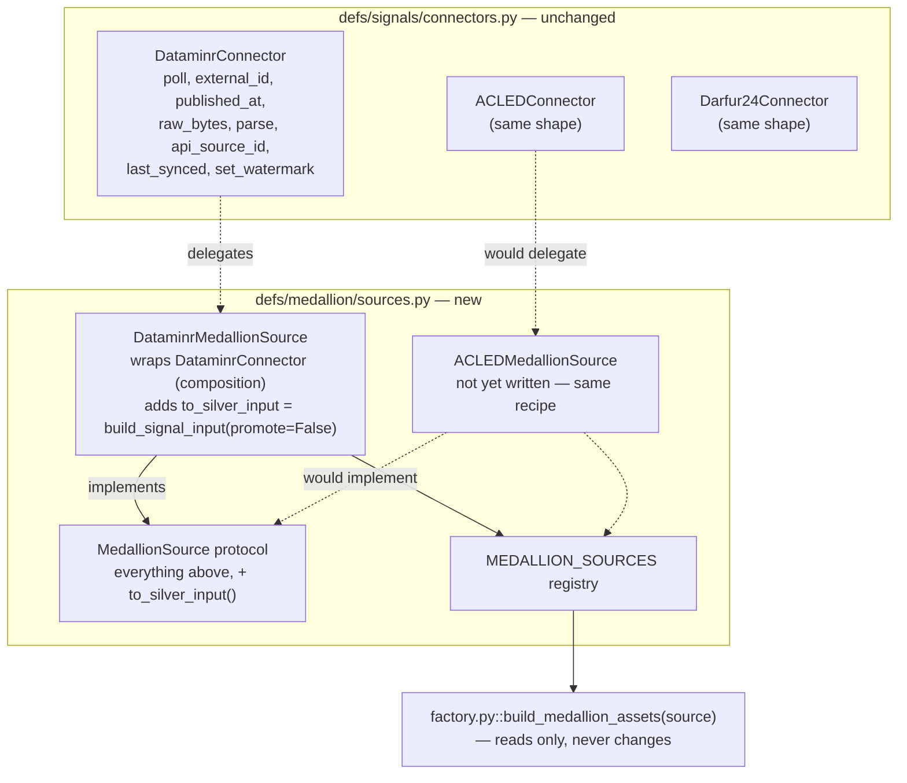
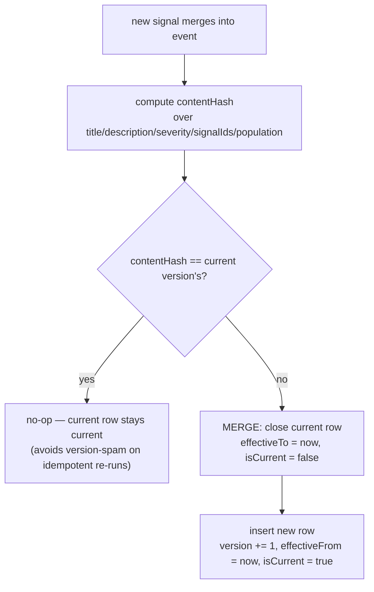

# Medallion pipeline implementation: architecture and first source (Dataminr)

Documents what got built in `defs/medallion/` — a generic bronze → silver →
gold factory, GX-gated at every promotion, with Dataminr as the first
source wired in. Companion to the per-source projected-pipeline docs
(`data-quality-dataminr-pipeline-map.md`, `-acled-`, `-darfur24-`), which
describe the *target*; this doc describes what's actually running.

## 1. Scope

Implements the bronze/silver/gold layers and the incremental push to
clear-api for one source (Dataminr), built as a **generic factory** so
ACLED, Darfur24, and IDMC are additive, not copy-paste. Nothing here writes
to clear-api until the final push step — bronze, silver, and gold are all
S3 artifacts.

Not covered: per-source quality-rule thresholds, aggregations for
ontology-new business objects, and integration tests against real
S3/clear-api — those stay open per the per-source mapping docs.

## 2. Package layout

```
src/clear_pipeline/defs/medallion/
├── sources.py    # MedallionSource protocol + per-source adapters (ONLY per-source code)
├── factory.py    # build_medallion_assets(source) -> 8 assets + 6 GX checks + 1 job
├── gx_utils.py   # Great Expectations Core helper, fully source-agnostic
└── assets.py     # loops MEDALLION_SOURCES -> module globals, for Dagster auto-discovery
```

Mirrors `defs/signals/`'s existing `connectors.py` + `factory.py` +
`assets.py` split deliberately, so the pattern is already familiar to
anyone who's touched the production ingest path.

**Isolated from `defs/signals/`**: this stands up the Dagster-native target
architecture alongside today's production path (`createSignal` at poll
time), not a replacement for it yet.

### The asset chain, per source

```mermaid
flowchart LR
    Bronze["&lt;source&gt;_bronze<br/>raw record -> S3"] -->|"bronze_shape<br/>BLOCKING"| Silver["&lt;source&gt;_silver<br/>normalize, no clear-api write"]
    Silver -->|"silver_completeness<br/>BLOCKING"| Classify["&lt;source&gt;_classify<br/>relevance + type"]
    Classify -->|"classify_populated<br/>observational"| Geo["&lt;source&gt;_geo<br/>heuristic district key"]
    Geo -->|"geo_resolution_rate<br/>observational"| Temporal["&lt;source&gt;_temporal<br/>new-vs-merged vs active window"]
    Temporal -->|"temporal_match_ratio<br/>observational"| Match["&lt;source&gt;_match<br/>create-or-merge, in-memory"]
    Match --> Gold["&lt;source&gt;_gold<br/>write signals + events tables"]
    Gold -->|"gold_integrity<br/>BLOCKING"| Push["&lt;source&gt;_push<br/>pushedAt IS NULL only -> clear-api"]
```



Solid arrows are the data path (each asset's output feeds the next via
`ins=`/`AssetIn`, §7); the check labels ride alongside as `@dg.asset_check`s
on the asset each one gates, not separate nodes in the actual graph.

Each layer's GX check:

| Asset | Check | Blocking? |
|---|---|---|
| `bronze` | shape: id + timestamp present, non-empty batch | Yes |
| `silver` | completeness (title/description), severity range, coord range | Yes |
| `classify` | relevance populated | No — observational |
| `geo` | district-resolution rate | No — observational |
| `temporal` | match-outcome in `{new_event, merged}` | No — observational |
| `gold` | severity range, referential integrity (`eventId` present) | Yes |

Blocking checks halt the next promotion on a suite-level failure past a
configurable threshold (`gx_utils.BLOCK_THRESHOLD`, default 0.5); below
threshold, they warn and the batch proceeds. Per-record failures are
isolated inside each asset (a `try/except` per record), matching the
production ingest's existing failure policy.

## 3. Adding a new source



Dotted lines mark what doesn't exist yet (ACLED shown as the worked
example — Darfur24/IDMC follow the same shape). Adding a source touches
`sources.py` only:

1. In `sources.py`, write a small adapter class that wraps the source's
   existing production connector (`defs/signals/connectors.py`) for
   everything bronze already needs (`poll`, `external_id`, `published_at`,
   `raw_bytes`, `parse`, `api_source_id`, `last_synced`, `set_watermark` —
   all delegate straight through), plus **one new method**,
   `to_silver_input(record, source_id) -> dict`, a pure transform with no
   clear-api write.
2. Register the adapter in `MEDALLION_SOURCES`.
3. Nothing else changes — `factory.py` and `assets.py` are source-agnostic.

For ACLED and Darfur24, step 1 needs a `promote: bool = False`-style
passthrough added to `build_acled_signal_input` / `build_darfur24_signal_input`
first, mirroring the fix already made to `build_signal_input` (§4). Darfur24
never calls the geoparser at all, so it may not need one.

## 4. Shared-code changes

Small, additive edits to code the production pipeline also uses — not
duplicated logic:

- **`providers/signal.py::build_signal_input`** gained a keyword-only
  `promote: bool = True` parameter, threaded to `enrich_with_geoparser`.
  Default preserves today's production behavior exactly; the medallion
  silver stage passes `promote=False`. See §5.1 for why this was necessary.
- **`defs/signals/lake.py`**:
  - `raw_key(..., layer: str = "raw")` — silver reuses the same
    day-partitioned key shape (`layer="silver"`), bronze unchanged.
  - New generic `write_json` / `read_json` / `list_keys` helpers for
    silver/gold's arbitrary-key JSON reads and writes (gold isn't
    date-partitioned like bronze/silver — it's keyed by signal/event id
    and rewritten in place as state changes).

## 5. Design decisions made during implementation

Two real gaps surfaced while building this that the projected-pipeline
docs hadn't fully resolved — both required a decision, not just naming.

### 5.1 Geoparser promotion was a hidden clear-api write

`build_signal_input` unconditionally called `enrich_with_geoparser` with
its default `promote=True`, which can create a real L4 landmark location
row in clear-api (`findOrCreateLandmarkL4`, a mutation) as a side effect of
what the projected-pipeline doc called a "no clear-api write" silver stage.
Reusing the function as-is would have silently broken that guarantee.

**Fix**: added the `promote` passthrough (§4) rather than duplicating
`build_signal_input`'s severity/casualties/description logic in the
medallion module. Silver still captures `geoparsedData` either way — only
the opportunistic location-row creation is skipped.

### 5.2 Admin-2 resolution needs a location that doesn't exist yet

Production's `resolve_signal_admin2` needs a location dict with
`id`/`level`/`ancestorIds` — which only exists **after** `createSignal` has
run server-side PostGIS resolution. Since silver/geo/temporal/match all
happen before any clear-api write, there is no authoritative admin-2 to
cluster on at that point.

**Decision** (first-pass, flagged in `factory.py`'s docstring with its
upgrade path):

- **Pre-push clustering** (`<source>_geo`) uses a heuristic: the second
  comma-segment of the geoparser's `display_name` (e.g. "El Fasher, North
  Darfur, Sudan" → "North Darfur"). Approximate, not authoritative.
- **The real `Event.locationId`** is resolved in `<source>_push`, right
  after each signal's `createSignal` call returns a real, PostGIS-resolved
  location — using the exact same `resolve_signal_admin2` production
  already relies on.

Upgrade path: once a read-only admin-2-from-coordinates lookup exists
outside clear-api, swap it into the geo stage and drop the heuristic.

```mermaid
sequenceDiagram
    participant Geo as &lt;source&gt;_geo
    participant Match as &lt;source&gt;_match
    participant Gold as &lt;source&gt;_gold (S3)
    participant Push as &lt;source&gt;_push
    participant API as clear-api

    Note over Geo: districtKey = display_name.split(",")[1]<br/>(heuristic — no clear-api call)
    Geo->>Match: cluster candidates by (districtKey, eventType)
    Match->>Gold: write gold event, districtKey still heuristic
    Note over Gold: gold rows sit with pushedAt = null<br/>until a push run picks them up
    Push->>API: createSignal(signalInput) per unpushed row
    API-->>Push: real, PostGIS-resolved location
    Note over Push: resolve_signal_admin2(createSignal result)<br/>— the SAME function production uses
    Push->>API: createEvent / updateEvent with the AUTHORITATIVE locationId
```

The heuristic only ever decides *which signals cluster together* before a
push exists to check against; the value that actually lands on the `Event`
row is always the real one, resolved the same way production resolves it
today.

### 5.3 Other documented simplifications

- **No LLM rewrite of merged event title/description.** Bootstrap only:
  first signal's title/description on create, latest signal's on merge.
  Upgrade path: call an equivalent rewrite once the gold event shape is
  stable and worth the LLM cost.
- **Single-writer S3 read-modify-write**, no cross-run locking (production
  wraps its equivalent step in `redis_lock`). Fine for one Dagster run at a
  time; add a lock if this ever runs concurrently.

## 6. Gold events persistence: SCD2, decided but not yet built

Today's committed code writes `gold/<source>/events/<eventId>.json` as a
single mutable file, overwritten in place every time a new signal merges
in — no history retained. That's fine for `<source>_push`'s own needs (it
only ever reads the current state), but it means there's no way to answer
"what did this Event look like before signal X merged in," which matters
for audit and debugging severity/title changes after the fact.

**Not everything in gold needs this** — only the events table is a genuine
slowly-changing dimension:

| Gold table | Nature | SCD2? |
|---|---|---|
| `signals` | written once, `pushedAt` flips null → timestamp | No — one status flip, Type-1 overwrite stays fine |
| `events` | title/description/severity/population/signalIds all change as signals merge in over the active window | **Yes** |

### 6.1 Format decision: Apache Iceberg, not Delta Lake

Both are "Parquet data files + a metadata/transaction log" — the data
itself is never locked in either way, and either format's native `MERGE`
gives the standard SCD2 upsert-or-close-and-insert pattern for free
instead of hand-rolling versioned files + a compaction story.

The deciding factor is **governance, not engineering**, and it matters
more here than usual because this project already leans toward
self-hosted, sovereignty-conscious infrastructure (S3-compatible storage,
Scaleway as the intended second cloud) rather than a single managed
vendor's stack:

- **Iceberg** was donated by Netflix to the **Apache Software
  Foundation**, which structurally requires a diverse committer/PMC base —
  no single company can dominate the roadmap by contribution volume alone.
  It also has broad *native*, multi-vendor support (Snowflake, AWS — S3
  Tables is built on it — BigQuery/BigLake, Trino, Flink) that isn't
  anchored to one company's compute product.
- **Delta Lake** was created by Databricks and donated to the **Linux
  Foundation**, which is genuinely open-license but doesn't carry the same
  anti-capture structural requirement — Databricks remains by far the
  dominant contributor and roadmap driver in practice. Its strongest
  support is naturally where Databricks sits in the stack.

**Caveat, deliberately not resolved here**: PyIceberg's native Python
write/merge path has historically lagged delta-rs's — this needs a direct
check (`pip show pyiceberg`, its current changelog, a small write/merge
smoke test) before committing, not an assumption carried over from either
side of this conversation. If PyIceberg's merge support turns out too
immature for a clean SCD2 implementation, that's a real reason to revisit
Delta despite the governance trade-off above — worth surfacing as a
blocker if hit, not silently working around.

### 6.2 SCD2 markers

```python
{
    "eventId": "...",              # business key, stable across versions
    "version": 3,                   # monotonic per eventId
    "effectiveFrom": "2026-09-10T12:00:00Z",
    "effectiveTo": None,             # None = current row
    "isCurrent": True,               # redundant with effectiveTo is None, kept for query ergonomics
    "contentHash": "sha256(...)",    # hash of the mutable fields — skip writing
                                       # a new version when nothing changed
    # ...the rest of today's event fields (title, description, severity,
    # signalIds, population, ...)
}
```

`effectiveTo: None` rather than a far-future sentinel date — this project
has no raw-SQL warehouse joins to keep NULL-free, and Iceberg/DuckDB both
handle NULL ranges cleanly. `contentHash` mirrors the content-hash dedup
pattern already used elsewhere in this codebase (IDMC's `_content_hash`,
the translation staleness check) — without it, every `push` run that
touches an event would write a "new version" even when nothing about it
actually changed, turning the history into noise instead of a signal.



### 6.3 Status

Decided, not implemented. `dataminr_gold`/`dataminr_push` still write the
mutable single-file JSON described at the top of this section. Follow-up
work, in order: verify PyIceberg's write/merge maturity directly (§6.1's
caveat), pick a catalog for a single-writer setup (a file-based or SQLite
catalog is likely sufficient — no REST catalog service needed for one
Dagster writer), then replace the events half of `<source>_gold` with an
Iceberg `MERGE`. Gold **signals** keeps its current shape unchanged.

## 7. A real wiring bug, found by testing rather than assumed away

The first draft wired Dagster's per-asset data dependencies with
`deps=["upstream_asset"]` plus a `**kwargs` catch-all parameter on the
downstream function, expecting Dagster to inject the upstream value by
name. **It doesn't** — `deps=` alone declares ordering only; Dagster
delivers an *empty* `kwargs` with no error, so every downstream asset would
have silently processed nothing.

Confirmed with a minimal reproduction before touching the real factory,
then fixed throughout with explicit input mapping:

```python
@dg.asset(name=f"{src}_silver", ins={"bronze_df": dg.AssetIn(key=f"{src}_bronze")})
def _silver(context, bronze_df: pd.DataFrame) -> pd.DataFrame:
    ...
```

This is exactly the class of bug a structural "does it import cleanly"
check would miss — worth calling out because it's why §8's end-to-end test
runs the real Dagster execution engine rather than calling functions
directly.

## 8. Verification

- **`tests/test_medallion_pipeline.py`** — a real `dagster.materialize()`
  run (not mocked at the Dagster level) against a fake in-memory S3 and
  fake `create_signal`/`create_event`/`escalate_to_alert`. Two synthetic
  records in the same district merge into one gold event; both push and
  get `pushedAt` stamped; a second run against the same state re-pushes
  nothing, confirming the incremental cursor. This is the test that would
  have caught §7's bug.
- **`ruff check`** — clean on every new/changed file.
- **`ty check`** — clean on `gx_utils.py` and `sources.py` (fixed one real
  finding: `DataminrMedallionSource.source` was a read-only `@property`
  against a `MedallionSource` protocol declaring a mutable `str` field —
  narrowed the protocol member to a read-only property). `factory.py`
  reports false positives against Great Expectations' dynamically-built
  Pydantic expectation classes, which no static checker resolves without
  GX-specific stubs — confirmed false by the real GX validation runs
  succeeding in the test above.
- **Existing suite**: `tests/test_signals_ingest_drain.py` still passes
  (17/18 — the one failure is a pre-existing sandbox permission error
  downloading a HuggingFace model, unrelated to this change and present on
  `dev` beforehand).

## 9. Not covered here

- Per-source quality-rule thresholds (blocking vs. non-blocking cutoffs) →
  task 2.
- Aggregations for ontology business objects beyond Signal/Event/Alert →
  task 3 (blocked on business-side ontology clarifications).
- ACLED / Darfur24 / IDMC adapters → §3's recipe, not yet written.
- Iceberg-backed gold events (SCD2) → §6, decided, not yet built.
- Integration tests against real S3/clear-api → task 6.
