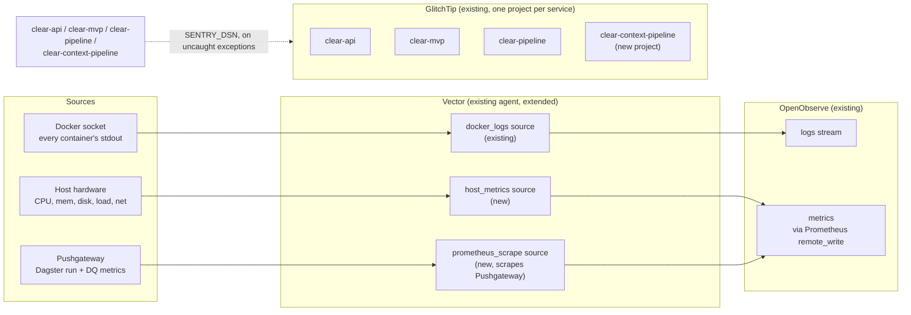

# Spec: Observability for the signals pipeline, plugging into the existing hub

## 1. Problem

This doc originally scoped a new self-hosted Grafana/Loki/Prometheus/Alertmanager
stack from a "nothing exists yet" premise. That premise was wrong. A hub
already exists, deployed by `clear-infra` (Terraform, Infomaniak Public
Cloud) and running today via `docker compose` on a single VM at `/srv/app`:

- **OpenObserve** (`dev-observe.clearinitiative.io`): logs, metrics, and
  traces in one binary, S3-backed storage.
- **GlitchTip** (`dev-sentry.clearinitiative.io`): self-hosted,
  Sentry-protocol-compatible error tracking, with projects already live for
  `clear-api`, `clear-mvp`, and `clear-pipeline`.
- **Vector** (not Promtail): reads every container's stdout via the Docker
  socket and ships it to OpenObserve's HTTP ingest.

This doc now covers what's still missing, and how to close it against the
existing hub rather than build a parallel one:

- **No metrics exist anywhere yet.** Not host hardware (CPU/mem/disk/OOM
  kills on the VM), not Dagster run outcomes, not data-quality pass/fail
  rates. Confirmed directly, not inferred.
- **`clear-context-pipeline` (this repo) has no GlitchTip project.**
  `clear-api`, `clear-mvp`, and the legacy `clear-pipeline` all have a
  `glitchtip_dsn_*` Terraform variable wired to a `SENTRY_DSN` env var.
  Dagster's exceptions land as raw text in OpenObserve's logs, not as
  deduped, triage-able GlitchTip issues the way clear-api's are.
- **The VM itself is moving**, from a Railway-hosted box to the
  `clear-infra` Terraform-managed Infomaniak VM. Whatever host-level
  visibility existed on Railway (if any) doesn't carry over automatically.

## 2. Goals / decisions

- **Plug into OpenObserve + GlitchTip + Vector. Don't stand up a second
  stack.** The original Grafana/Loki/Prometheus/Alertmanager plan is
  superseded by this, not layered next to it.
- **Extend Vector, don't add a second agent.** Vector already runs on the
  VM with Docker-socket access and a trusted config pattern
  (`envs/dev/main.tf`'s `local.vector_config`). Vector natively has a
  `host_metrics` source (CPU/mem/disk/load/network, no separate
  `node_exporter` needed) and both `prometheus_scrape` and
  `prometheus_remote_write` support. One agent, not two.
- **Keep Prometheus Pushgateway for Dagster's batch-style metrics.** A
  Dagster run isn't a long-lived scrape target, so something still needs to
  receive a one-shot push per run. Pushgateway is the standard, purpose-built
  Prometheus-ecosystem answer to exactly this problem, it doesn't get
  replaced by switching the storage backend, only rewired: Vector scrapes
  Pushgateway's `/metrics` and forwards to OpenObserve, instead of a
  standalone Prometheus server doing the scraping.
- **Close the GlitchTip gap.** Add a fourth GlitchTip project + `SENTRY_DSN`
  for `clear-context-pipeline`, matching the pattern already used for the
  other three services. `config.py`'s scaffolded-but-unused `sentry_dsn`
  finally gets wired to something real.
- **No alert receivers wired yet**, same as the original scope. OpenObserve
  has its own basic alert rules (webhook/email/Slack destinations); revisit
  Alertmanager only if that stops being enough, see §8.

## 3. Architecture

One shipper, two destinations, both already deployed:



- **Logs**: unchanged. Vector's existing `docker_logs` source already
  captures ingest, business-logic, and error-traceback log lines from every
  container, `app-dagster-code-1` included, this already covers the whole
  data lifecycle (bronze ingest through the silver-to-gold business logic),
  not just the API. Nothing to build here.
- **Host metrics**: new. Vector's `host_metrics` source reads
  `/proc`/`/sys` directly (mounted read-only, same trust boundary as the
  Docker socket mount it already has) and needs a new
  `prometheus_remote_write` sink pointed at OpenObserve's remote-write
  endpoint. No new container.
- **Dagster run + data-quality metrics**: new. A small `pushgateway`
  container (the standard `prom/pushgateway` image) receives one push per
  run from the `run_status_sensor` (§4, unchanged from the original design).
  Vector gets a new `prometheus_scrape` source aimed at
  `http://pushgateway:9091/metrics`, feeding the same
  `prometheus_remote_write` sink as host metrics.
- **Errors**: existing pattern, one gap closed. `clear-api`, `clear-mvp`,
  and `clear-pipeline` already report uncaught exceptions to GlitchTip via
  `SENTRY_DSN`. `clear-context-pipeline` gets the same treatment: a fourth
  GlitchTip project, a `glitchtip_dsn_clear_context_pipeline` Terraform
  variable, and the DSN wired into the `dagster-code` service's env.
- **Verify the remote-write path before depending on it.** OpenObserve
  documents a Prometheus-remote-write-compatible ingestion endpoint, but its
  exact org-scoped path and its handling of exemplars/native histograms
  hasn't been smoke-tested against this deployment yet. Confirm this against
  the live `dev-observe` instance before wiring the sensor, not after.

## 4. Dagster-side changes (this repo)

Unchanged from the original design, because none of it depended on which
backend receives the push:

New package `src/clear_context_pipeline/defs/observability/` (auto-discovered
by `definitions.py`'s `load_from_defs_folder`, no registration needed):

- `metrics.py`: thin `prometheus_client` wrapper: `push_run_metrics(job,
  status, duration_seconds, **labels)` using `push_to_gateway`. No-ops if
  `settings.pushgateway_url` is unset, same "inert until configured"
  convention as `idmc_client_id` etc.
- `sensors.py`: one `@dg.run_status_sensor` (un-pinned, fires for every
  job) reacting to `DagsterRunStatus.SUCCESS`/`.FAILURE`. On fire: reads the
  run's duration and any `MaterializeResult`/`AssetCheckEvaluation` metadata
  already attached to the run's events, and calls `push_run_metrics`. Ships
  `default_status=dg.DefaultSensorStatus.STOPPED`, matching
  `poll_sensor.py`'s convention, nothing pushes until explicitly turned on.
- `checks.py`: a small, representative set of `@dg.asset_check`s added
  generically inside `factory.py`'s `build_source_assets` (one check per
  polled source, parametrized off the existing `created`/`failed` counts
  already computed in the ingest loop) that fails when the per-run failure
  rate crosses a threshold.

`config.py` additions (same empty-default `Settings` convention as the rest
of the file):
```python
pushgateway_url: str = ""
observability_service_name: str = "clear-context-pipeline"
```

`pyproject.toml`: add `prometheus-client` to main deps.

**New**: wire `config.py`'s already-scaffolded `sentry_dsn` to an actual
`sentry-sdk` (or `glitchtip`-compatible) initialization at process start, now
that there's a real DSN to point it at. This was dead code before; it isn't
anymore.

## 5. The hub itself

Everything in this section lives in **`clear-infra`** (Terraform), not this
repo, there is no `deploy/observability/` folder in `clear-context-pipeline`
anymore. Changes needed in `envs/dev/main.tf`:

- Extend `local.vector_config`: add a `host_metrics` source, a
  `prometheus_scrape` source targeting the new `pushgateway` service, and a
  `prometheus_remote_write` sink to OpenObserve. Keep the existing
  `docker_logs` source and `openobserve` (logs) sink untouched.
- Add a `pushgateway` service to the compose `services:` block (image
  `prom/pushgateway`, no persistent volume needed, values are ephemeral
  between pushes by design).
- Add `glitchtip_dsn_clear_context_pipeline` to `variables.tf` and
  `terraform.tfvars.example`, following the exact pattern of
  `glitchtip_dsn_clear_api`.
- Wire `PUSHGATEWAY_URL=http://pushgateway:9091` and the new
  `SENTRY_DSN=${var.glitchtip_dsn_clear_context_pipeline}` into the
  `dagster-code` service's env block.
- Create the fourth GlitchTip project by hand (or via its API) the same way
  the first three were created, then paste the generated DSN into
  `terraform.tfvars`.

## 6. Non-goals for this pass

- Tracing (OpenTelemetry). Not requested. OpenObserve already speaks OTLP
  natively, so this is closer than it was under the original Grafana/Tempo
  plan. Still not this pass.
- `DockerRunLauncher`/true per-run hardware isolation. Dagster forks each
  run as a subprocess of the daemon container, so no metrics backend, this
  one included, can attribute host or container usage to one specific run.
  That's a Dagster deployment-model limitation, not something switching
  observability tools fixes.
- Alert routing/receivers. OpenObserve's dashboards, logs, and metrics are
  the deliverable; its alert rules stay unconfigured for now, same as the
  original scope.
- Host-level OS logs (journald/syslog) and non-Docker log files (e.g.
  Caddy's access log). Vector can take these as additional sources using
  the same pattern as `host_metrics`, genuinely easy to add later, just not
  scoped into this pass.

## 7. Verification

- Add the `host_metrics` and `prometheus_scrape` sources plus the
  `prometheus_remote_write` sink to `vector_config`, `terraform apply`, then
  confirm in OpenObserve's Metrics explorer that host CPU/mem series are
  arriving.
- Enable the new `run_status_sensor` locally in Dagster dev, materialize
  `raw_idmc` (known-working from prior work on this branch), push a test
  metric through the local Pushgateway, confirm it's visible in OpenObserve
  after the next Vector scrape interval.
- Trigger a deliberate exception in a local Dagster run with `SENTRY_DSN`
  pointed at the new GlitchTip project, confirm the issue appears in
  GlitchTip, not just as a log line in OpenObserve.
- No repo-wide lint/test command exists yet, run `uv run pytest` for
  anything under `tests/`, and spot-check the new modules with
  `python -c "import clear_context_pipeline.definitions"` to confirm
  `load_from_defs_folder` picks them up without error.

## 8. Limitations of this architecture, and where a more standard alternative fits

Plugging into the existing hub is the right call, it avoids running a second
stack for no reason. It also inherits some real limitations worth naming
rather than glossing over.

- **Single VM, shared fate.** App services, Vector, OpenObserve, and
  GlitchTip all run via `docker compose` on the same box. If that VM goes
  down, you lose the app and the tooling that would tell you why, at the
  same time. OpenObserve's data itself survives (it's stored in Infomaniak
  Object Storage, not on local disk), but live ingestion and the query UI
  stop until the VM is back. There's no better-open-standard fix for this
  specific trade-off short of running the observability plane on separate
  infrastructure from the app, which is a real cost/ops decision, not a
  tooling swap, and out of scope here.
- **OpenObserve is younger and less battle-tested than Prometheus + Grafana
  + Loki.** Its query language and alerting are its own, not PromQL/LogQL,
  and its dashboard/plugin ecosystem is smaller than Grafana's. The
  mitigation isn't switching backends, it's keeping instrumentation
  portable: prefer OTLP over OpenObserve-specific HTTP ingest wherever a
  choice exists (already true for logs via Vector; will be true for traces
  if that's ever tackled), so a future backend swap doesn't require
  re-instrumenting every service. If OpenObserve's own dashboarding proves
  limiting later, Grafana can be pointed at OpenObserve's Prometheus-
  compatible query endpoint without touching ingestion at all.
- **Vector's Docker-socket mount is host-root-equivalent access.** True of
  any `docker_logs`-style shipper (Promtail included), not unique to this
  choice, but worth stating plainly rather than treating the socket mount
  as a routine detail.
- **OpenObserve's built-in alerting is simpler than Alertmanager's.**
  Alertmanager (the Prometheus ecosystem's purpose-built alert router) has
  mature grouping, silencing, and inhibition semantics that OpenObserve's
  rule-plus-destination model doesn't match today. Not a problem while
  "dashboards and logs only, no alert receivers" is the actual scope (§2),
  but the open standard to reach for if alert routing grows past one or two
  Slack webhooks is Alertmanager specifically, not a bigger OpenObserve
  ruleset.
- **Prometheus remote-write compatibility is unverified here.** "OpenObserve
  accepts Prometheus remote-write" is a documented claim, not yet a tested
  fact against this deployment. Smoke-test it (§7) before the Dagster
  sensor depends on it in production.

None of these are reasons to reconsider plugging into the existing hub, they're
the specific places where "the existing thing" trades some maturity for
"one less stack to run." Worth revisiting if any of them starts to bite in
practice, not worth solving preemptively.
